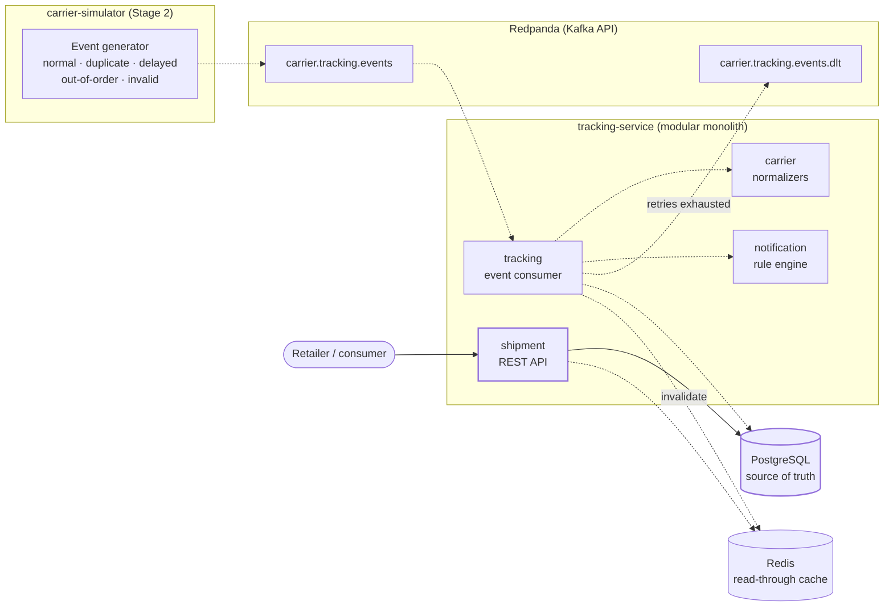

# ParcelFlow — Distributed Shipment Event Processor

ParcelFlow ingests shipment tracking events from multiple delivery carriers, normalizes their
different formats into one event vocabulary, maintains the current status of every parcel, preserves
full tracking history, and generates notification records for delivery milestones.

The interesting part is not the CRUD. It is what happens when the event stream misbehaves:
duplicates, out-of-order arrivals, malformed payloads, and concurrent updates to the same parcel.

> ParcelFlow is an independent portfolio and training project. It is not affiliated with or based on
> proprietary systems from any delivery carriers or ecommerce retailers.

Carrier names in this project (`SWIFTPOST`, `NORDEX`, `PACIFICA`, `METROLINK`) are fictional.

---

## Build status

| Stage | Scope | State |
|-------|-------|-------|
| **1** | Repo structure, Gradle build, Docker Compose, database schema, Shipment REST API, tests | ✅ Complete — 35 tests passing |
| 2 | Kafka, carrier simulator, event consumer, normalization, tracking history | Not started |
| 3 | Duplicate detection, out-of-order handling, retries, DLQ, notifications, Redis cache | Not started |
| 4 | Metrics, structured logging, integration tests, performance test, final docs | Not started |

Stage 1 is a working vertical slice: you can register a parcel over HTTP, read it back, and list a
retailer's parcels, all against real PostgreSQL with Flyway-managed schema.

---

## Architecture

Target architecture across all four stages. Solid lines are implemented in Stage 1; dashed lines
arrive in Stages 2 and 3.



Deliberately **one** service, not many. Splitting shipment writes and event ingestion across
processes would add distributed transactions to a problem that does not need them: the event
consumer updates the shipment, appends history, and creates the notification record in a single
local transaction. The module boundaries (`shipment`, `tracking`, `carrier`, `notification`) are
enforced by package structure, so the notification module could be extracted later if it ever earned
its own deployment.

---

## Technology stack

| Concern | Choice |
|---|---|
| Language | Java 25 |
| Framework | Spring Boot 4.1 (Spring Framework 7) |
| Build | Gradle 9.5 multi-project, wrapper included |
| Database | PostgreSQL 17, schema owned by Flyway |
| Messaging | Redpanda (Kafka API) — *Stage 2* |
| Cache | Redis — *Stage 3* |
| API docs | springdoc-openapi 3.1 (OpenAPI 3.1) |
| Observability | Spring Boot Actuator + Micrometer / Prometheus |
| Testing | JUnit 6, AssertJ, MockMvc, Testcontainers 2 |
| Packaging | Docker multi-stage build, Docker Compose |

Spring Boot 4 notes worth knowing if you build on this: the web starter is now
`spring-boot-starter-webmvc`, Flyway needs `spring-boot-starter-flyway`, MockMvc test support moved
to `spring-boot-starter-webmvc-test`, and Jackson 3 (`tools.jackson`) is the default JSON mapper.

---

## Running it

### Everything in Docker

```bash
docker compose up --build
```

Compose waits for PostgreSQL's `pg_isready` check before starting the service, and the service's own
health check hits `/actuator/health/readiness`, so it only reports healthy after Flyway has finished
migrating.

```bash
docker compose ps          # both containers should read (healthy)
docker compose logs -f tracking-service
docker compose down        # add -v to drop the database volume
```

| Service | URL |
|---|---|
| API | http://localhost:8080 |
| Swagger UI | http://localhost:8080/swagger-ui.html |
| OpenAPI JSON | http://localhost:8080/v3/api-docs |
| Health | http://localhost:8080/actuator/health |
| Prometheus metrics | http://localhost:8080/actuator/prometheus |
| PostgreSQL | `localhost:5432` — `parcelflow` / `parcelflow` / db `parcelflow` |

### Locally against a containerized database

```bash
docker compose up -d postgres
./gradlew :tracking-service:bootRun
```

### Tests

```bash
./gradlew test
```

Requires a running Docker daemon: the integration tests start a real PostgreSQL container via
Testcontainers. No mocked database anywhere.

---

## API examples

Register a shipment:

```bash
curl -i -X POST http://localhost:8080/api/shipments \
  -H 'Content-Type: application/json' \
  -d '{
        "retailerId": "retailer-42",
        "customerId": "cust-9f13",
        "trackingNumber": "SP100000000042",
        "carrierCode": "SWIFTPOST",
        "estimatedDeliveryDate": "2026-08-12"
      }'
```

```
HTTP/1.1 201
Location: /api/shipments/00c5356b-8b0b-47e5-b88c-1e504dd2bf34
```
```json
{
  "shipmentId": "00c5356b-8b0b-47e5-b88c-1e504dd2bf34",
  "retailerId": "retailer-42",
  "trackingNumber": "SP100000000042",
  "carrierCode": "SWIFTPOST",
  "currentStatus": "LABEL_CREATED",
  "estimatedDeliveryDate": "2026-08-12",
  "lastEventTime": null,
  "version": 0,
  "createdAt": "2026-08-05T20:32:34.255796Z",
  "updatedAt": "2026-08-05T20:32:34.255796Z"
}
```

Read current status, and list a retailer's parcels:

```bash
curl http://localhost:8080/api/shipments/00c5356b-8b0b-47e5-b88c-1e504dd2bf34
curl 'http://localhost:8080/api/retailers/retailer-42/shipments?page=0&size=20&status=IN_TRANSIT'
```

Errors are RFC 9457 `application/problem+json` with a stable `type` URI, so clients branch on the
error kind rather than parsing prose. Re-posting the same tracking number returns `409`:

```json
{
  "type": "https://parcelflow.example/problems/duplicate-tracking-number",
  "title": "Duplicate tracking number",
  "status": 409,
  "detail": "Shipment already exists for carrier SWIFTPOST and tracking number SP100000000042",
  "instance": "/api/shipments",
  "carrierCode": "SWIFTPOST",
  "trackingNumber": "SP100000000042"
}
```

Validation failures return `400` with a flat per-field map:

```json
{
  "type": "https://parcelflow.example/problems/validation-failed",
  "title": "Validation failed",
  "status": 400,
  "errors": {
    "customerId": "must not be blank",
    "retailerId": "must not be blank",
    "trackingNumber": "must not be blank"
  }
}
```

### Endpoints

| Method | Path | Stage |
|---|---|---|
| `POST` | `/api/shipments` | 1 |
| `GET` | `/api/shipments/{shipmentId}` | 1 |
| `GET` | `/api/retailers/{retailerId}/shipments` | 1 |
| `GET` | `/api/shipments/{shipmentId}/events` | 2 |
| `GET` | `/api/shipments/{shipmentId}/notifications` | 3 |
| `POST` | `/api/admin/failed-events/{eventId}/retry` | 3 |

---

## Distributed systems challenges demonstrated

| Challenge | Approach |
|---|---|
| **Duplicate events** | Unique constraint on `event_id` in PostgreSQL, not just consumer configuration. Kafka gives at-least-once delivery; a rebalance replays an uncommitted offset regardless of how the consumer is tuned, so the database has to be the last line of defence. *(Stage 3)* |
| **Out-of-order events** | Ordering authority is the carrier's per-shipment `sequenceNumber`, with `eventTime` as tie-breaker. An older event is still appended to history but does not move `currentStatus`. Implemented and unit-tested in Stage 1 (`Shipment.recordEvent`). |
| **Non-linear status** | Statuses are deliberately unranked. `DELAYED` and `DELIVERY_ATTEMPTED` are exception states that can occur at several points, and `ARRIVED_AT_FACILITY` repeats — an integer rank would encode a false model of a carrier network. |
| **Terminal state** | `DELIVERED` is sticky, so a backfilled scan with a higher sequence number cannot un-deliver a parcel. |
| **Concurrent updates** | JPA `@Version` optimistic locking on the shipment row. Two consumer threads handling events for the same parcel cannot silently lose an update; the loser retries the whole read-decide-write cycle. |
| **Invalid events** | Bounded retries, then the Dead Letter Queue with enough error context to investigate. Permanently invalid messages are not retried forever. *(Stage 3)* |
| **Cache coherence** | Redis caches the tracking response; PostgreSQL stays the source of truth and cache entries are invalidated when an event advances the shipment. *(Stage 3)* |
| **Duplicate registration race** | `POST /api/shipments` relies on the `(carrier_code, tracking_number)` unique constraint, not a `SELECT`-then-`INSERT` check that two concurrent requests could both pass. |

---

## Documentation

- [docs/architecture.md](docs/architecture.md) — module boundaries, data model, design decisions
- [docs/testing.md](docs/testing.md) — testing strategy and what each test proves
- `docs/event-processing.md` — event pipeline, idempotency, DLQ *(Stage 2–3)*
- `docs/performance-results.md` — load test script and results template *(Stage 4)*

---

## Limitations and future improvements

Known limitations, stated plainly:

- **Single consumer instance.** Partition-key correctness (all events for a parcel on one partition)
  is designed for but not yet exercised across multiple instances.
- **No schema registry.** The carrier event contract is JSON validated at the edge. A registry with
  Avro or Protobuf would catch producer-side breakage at publish time instead of consume time.
- **`sequenceNumber` is trusted.** Real carriers sometimes omit or reset it; the fallback to
  `eventTime` handles absence but not a reset.
- **Notification records only.** Nothing is delivered to a real channel, by design.
- **No authentication.** Out of MVP scope. A real deployment needs retailer-scoped authorization on
  every endpoint, since `GET /api/retailers/{retailerId}/shipments` is otherwise a data leak.
- **No tracing.** Metrics and structured logs (Stage 4) give aggregate visibility; OpenTelemetry
  spans would give per-event causality.

Candidate next steps once the MVP is done: multiple consumer instances with a rebalance test, a
schema registry, OpenTelemetry tracing, extracting `notification` into its own service, chaos
testing of the broker and database, and a minimal React tracking page.

---

## Repository layout

```
parcel-flow/
├── build.gradle                 # shared config for all subprojects
├── settings.gradle
├── docker-compose.yml
├── docs/
├── tracking-service/
│   ├── Dockerfile
│   ├── build.gradle
│   └── src/
│       ├── main/java/ca/vm/parcelflow/
│       │   ├── carrier/         # carrier codes; normalizers (Stage 2)
│       │   ├── shipment/        # aggregate, service, REST API
│       │   ├── tracking/        # event consumer, history (Stage 2)
│       │   ├── notification/    # notification rules (Stage 3)
│       │   ├── infrastructure/  # framework wiring
│       │   └── shared/          # cross-module API concerns
│       ├── main/resources/db/migration/
│       └── test/java/ca/vm/parcelflow/
└── carrier-simulator/           # Stage 2
```
