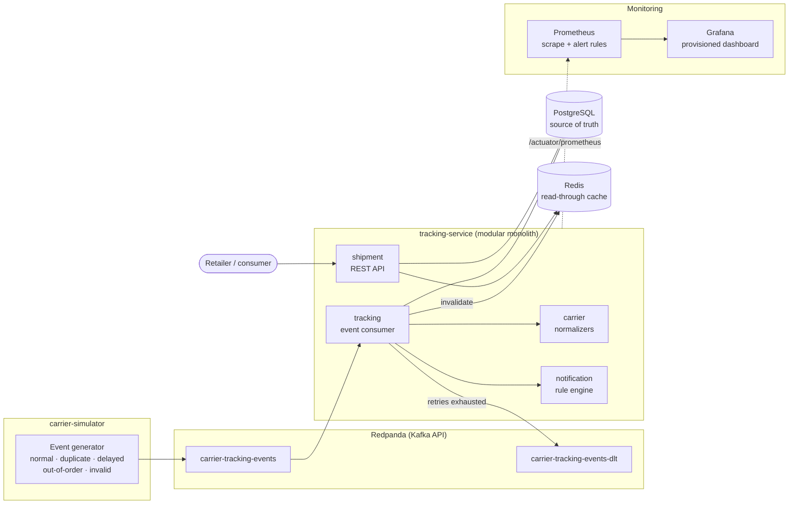

# ParcelFlow — Distributed Shipment Event Processor

<!-- Replace OWNER/REPO with this repository's path once it is pushed to GitHub. -->
[](https://github.com/OWNER/REPO/actions/workflows/ci.yml)

ParcelFlow ingests shipment tracking events from multiple delivery carriers, normalizes their
different formats into one event vocabulary, maintains the current status of every parcel, preserves
full tracking history, and generates notification records for delivery milestones.

The interesting part is not the CRUD. It is what happens when the event stream misbehaves:
duplicates, out-of-order arrivals, malformed payloads, and concurrent updates to the same parcel.

> ParcelFlow is an independent portfolio and training project. It is not affiliated with or based on
> proprietary systems from any delivery carriers or ecommerce retailers.

Carrier names in this project (`SWIFTPOST`, `NORDEX`, `PACIFICA`, `METROLINK`) are fictional.

## The business scenario

An ecommerce retailer ships through several carriers and wants one consistent answer to "where is my
parcel". Each carrier publishes scan events in its own vocabulary, on its own schedule, with its own
idea of reliability: the same scan arrives twice, a backfilled scan arrives after a later one, and
occasionally a payload is malformed. The retailer's customers want a status and a history; the
retailer wants to know which parcels are stuck; the customer wants a message when something
meaningful happens.

ParcelFlow is the piece in the middle. It takes those event streams, turns them into one status model
and one history per parcel, decides which milestones deserve a customer notification, and stays
correct while the stream misbehaves.

---

## Build status

| Stage | Scope | State |
|-------|-------|-------|
| **1** | Repo structure, Gradle build, Docker Compose, database schema, Shipment REST API, tests | ✅ Complete |
| **2** | Kafka, carrier simulator, event consumer, normalization, tracking history | ✅ Complete |
| **3** | Idempotency, out-of-order handling, retries, DLQ, notifications, Redis cache | ✅ Complete |
| **4** | Metrics, alerting, structured logging, tracing, Prometheus + Grafana, k6 load test, CI, quality gates, docs | ✅ Complete — 226 tests passing |

A complete, resilient, observable vertical slice: register a parcel over HTTP, have a carrier publish
its own event codes to Kafka, watch them get normalized and applied, and read the resulting status,
history and notifications back over REST — while the pipeline absorbs duplicate deliveries,
out-of-order arrival, concurrent updates, invalid payloads and a Redis outage, and reports on all of
it through Prometheus, Grafana and structured JSON logs.

---

## Architecture

Everything below is implemented.



More diagrams — system context, containers, and sequence diagrams for the successful, duplicate,
out-of-order and dead-letter paths — are in [docs/architecture.md](docs/architecture.md#12-diagrams).

Deliberately **one** service, not many. Splitting shipment writes and event ingestion across
processes would add distributed transactions to a problem that does not need them: the event
consumer updates the shipment, appends history, and creates the notification record in a single
local transaction. The module boundaries (`shipment`, `tracking`, `carrier`, `notification`) are
enforced by package structure, so the notification module could be extracted later if it ever earned
its own deployment.

---

## Technology stack

| Concern | Choice |
|---|---|
| Language | Java 25 |
| Framework | Spring Boot 4.1 (Spring Framework 7) |
| Build | Gradle 9.5 multi-project, wrapper included |
| Database | PostgreSQL 17, schema owned by Flyway |
| Messaging | Redpanda (Kafka API), Spring Kafka 4 |
| Cache | Redis 7, via Spring Cache |
| API docs | springdoc-openapi 3.1 (OpenAPI 3.1) |
| Observability | Spring Boot Actuator, Micrometer, Prometheus, Grafana, Micrometer Tracing (Brave) |
| Logging | ECS-structured JSON via Spring Boot's built-in structured logging |
| Testing | JUnit 6, AssertJ, MockMvc, Awaitility, Testcontainers 2 |
| Load testing | k6 |
| Quality | Checkstyle, JaCoCo, OWASP Dependency-Check, SonarQube Community Build |
| CI | GitHub Actions |
| Packaging | Docker multi-stage build, Docker Compose |

Spring Boot 4 notes worth knowing if you build on this: the web starter is now
`spring-boot-starter-webmvc`, Flyway needs `spring-boot-starter-flyway`, MockMvc test support moved
to `spring-boot-starter-webmvc-test`, and Jackson 3 (`tools.jackson`) is the default JSON mapper.

---

## Running it

### Everything in Docker

```bash
docker compose up --build
```

Compose gates startup on health checks: the service waits for PostgreSQL's `pg_isready` and
Redpanda's `rpk cluster health`, and its own check hits `/actuator/health/readiness`, so it reports
healthy only after Flyway has migrated. The two Kafka topics are created by the service at startup.

```bash
docker compose ps          # postgres, redpanda and tracking-service should read (healthy)
docker compose logs -f tracking-service
docker compose down        # add -v to drop the database and broker volumes
```

| Service | URL |
|---|---|
| API | http://localhost:8080 |
| Swagger UI | http://localhost:8080/swagger-ui.html |
| OpenAPI JSON | http://localhost:8080/v3/api-docs |
| Health (everything, including Redis) | http://localhost:8080/actuator/health |
| Liveness | http://localhost:8080/actuator/health/liveness |
| Readiness (PostgreSQL + Kafka) | http://localhost:8080/actuator/health/readiness |
| Metrics, Prometheus format | http://localhost:8080/actuator/prometheus |
| **Grafana dashboard** | **http://localhost:3000** — no login, opens on the ParcelFlow dashboard |
| **Prometheus** | **http://localhost:9090** — targets at `/targets`, alerts at `/alerts` |
| PostgreSQL | `localhost:5432` — `parcelflow` / `parcelflow` / db `parcelflow` |
| Kafka (Redpanda) | `localhost:19092` from the host, `redpanda:9092` between containers |
| Redpanda admin | http://localhost:9644 |
| Redis | `localhost:6379` |

`carrier-simulator` sits behind a Compose profile so `up` does not start it — it is a one-shot CLI.
Because of that, `up --build` does **not** rebuild it; run `docker compose build carrier-simulator`
after changing it. See the demo below.

### Locally against containerized infrastructure

```bash
docker compose up -d postgres redpanda
./gradlew :tracking-service:bootRun
```

### Tests and quality gates

```bash
./gradlew test                            # 226 tests: unit + integration
./gradlew checkstyleMain checkstyleTest   # style; violations fail the build
./gradlew jacocoTestReport                # coverage, per module
./gradlew build                           # all of the above, plus the jars
./gradlew dependencyCheckAnalyze          # OWASP; slow without an NVD_API_KEY

./gradlew :tracking-service:test --tests '*IdempotencyAndOrdering*'   # one slice
```

Requires a running Docker daemon: the integration tests start real PostgreSQL, Redpanda and Redis
containers via Testcontainers. No mocked database and no embedded broker anywhere.

What blocks CI and what is advisory — and why — is in
[docs/testing.md](docs/testing.md#stage-4-quality-gates).

### Performance test

```bash
export PARCELFLOW_LOAD_TESTING_ENABLED=true       # the publish endpoint is off by default
docker compose up -d --force-recreate tracking-service
docker compose --profile perf run --rm k6 run /scripts/parcelflow-load-test.js
```

`export`, not a one-off prefix: Compose recreates a service whose environment changed, so running the
second command without it silently restarts the service with the endpoint disabled.

Everything is configurable:

```bash
SHIPMENT_COUNT=1000 VIRTUAL_USERS=50 TEST_DURATION=5m EVENT_RATE=500 \
  DUPLICATE_PERCENTAGE=25 OUT_OF_ORDER_PERCENTAGE=20 \
  docker compose --profile perf run --rm k6 run /scripts/parcelflow-load-test.js
```

The scenario creates shipments, publishes events at a target rate with a controlled share of
duplicates and out-of-order arrivals, reads status and history concurrently, and reconciles what it
published against the service's own counters at the end. Measured results, with the machine they came
from, are in [docs/performance-results.md](docs/performance-results.md).

---

## Demo

A twelve-step script with exact commands — normal delivery, duplicates, out-of-order arrival, an
invalid payload, the dashboards, and a Redis outage — is in [docs/demo.md](docs/demo.md). The short
version follows.

### A parcel from label to doorstep

```bash
docker compose up --build -d

# 1. A retailer registers a parcel
SHIPMENT_ID=$(curl -s -X POST http://localhost:8080/api/shipments \
  -H 'Content-Type: application/json' \
  -d '{"retailerId":"retailer-42","customerId":"cust-9f13",
       "trackingNumber":"SP100000000042","carrierCode":"SWIFTPOST"}' \
  | python3 -c 'import sys,json;print(json.load(sys.stdin)["shipmentId"])')

# 2. The carrier publishes its own event codes to Kafka
docker compose run --rm carrier-simulator \
  --shipment-id=$SHIPMENT_ID \
  --tracking-number=SP100000000042 \
  --carrier=SWIFTPOST \
  --scenario=NORMAL \
  --delay-ms=300

# 3. The parcel is now DELIVERED, and version is 8 — one optimistic-lock
#    increment per applied event
curl -s http://localhost:8080/api/shipments/$SHIPMENT_ID

# 4. Full history, oldest first, with both readings of every scan
curl -s http://localhost:8080/api/shipments/$SHIPMENT_ID/events
```

Swap `--carrier=PACIFICA` (with a `PACIFICA` shipment) to watch a completely different carrier
vocabulary — `MANIFESTED`, `COLLECTED`, `MOVING`, `COMPLETE` — normalize to the same statuses.

### Demo: the pipeline misbehaving

Every scenario is reproducible with `--seed`.

```bash
# Duplicate delivery — 12 messages published, 8 events stored, 3 notifications
docker compose run --rm carrier-simulator --shipment-id=$ID --tracking-number=SP-D \
  --carrier=SWIFTPOST --scenario=DUPLICATE --seed=7

# Out-of-order arrival — full history preserved, no status regression
docker compose run --rm carrier-simulator --shipment-id=$ID --tracking-number=SP-O \
  --carrier=SWIFTPOST --scenario=OUT_OF_ORDER --seed=5

# Invalid payload — one failed_events row, one dead letter, consumer keeps running
docker compose run --rm carrier-simulator --shipment-id=$ID --tracking-number=SP-I \
  --carrier=SWIFTPOST --scenario=INVALID_EVENT --seed=11

curl -s 'http://localhost:8080/api/admin/failed-events'
docker compose exec redpanda rpk topic consume carrier-tracking-events-dlt -n 1

# Kill the cache — reads and ingestion keep working, readiness stays UP
docker compose stop redis
curl -s http://localhost:8080/api/shipments/$ID
curl -s -o /dev/null -w '%{http_code}\n' http://localhost:8080/actuator/health/readiness
docker compose start redis
```

Scenarios: `NORMAL`, `DUPLICATE`, `OUT_OF_ORDER`, `INVALID_EVENT`, `UNKNOWN_CARRIER_EVENT`,
`RAPID_CONCURRENT_EVENTS`. Full table in
[docs/event-processing.md](docs/event-processing.md#10-running-the-simulator-scenarios).

---

## API examples

Register a shipment:

```bash
curl -i -X POST http://localhost:8080/api/shipments \
  -H 'Content-Type: application/json' \
  -d '{
        "retailerId": "retailer-42",
        "customerId": "cust-9f13",
        "trackingNumber": "SP100000000042",
        "carrierCode": "SWIFTPOST",
        "estimatedDeliveryDate": "2026-08-12"
      }'
```

```
HTTP/1.1 201
Location: /api/shipments/00c5356b-8b0b-47e5-b88c-1e504dd2bf34
```
```json
{
  "shipmentId": "00c5356b-8b0b-47e5-b88c-1e504dd2bf34",
  "retailerId": "retailer-42",
  "trackingNumber": "SP100000000042",
  "carrierCode": "SWIFTPOST",
  "currentStatus": "LABEL_CREATED",
  "estimatedDeliveryDate": "2026-08-12",
  "lastEventTime": null,
  "version": 0,
  "createdAt": "2026-08-05T20:32:34.255796Z",
  "updatedAt": "2026-08-05T20:32:34.255796Z"
}
```

Read current status, and list a retailer's parcels:

```bash
curl http://localhost:8080/api/shipments/00c5356b-8b0b-47e5-b88c-1e504dd2bf34
curl 'http://localhost:8080/api/retailers/retailer-42/shipments?page=0&size=20&status=IN_TRANSIT'
```

Errors are RFC 9457 `application/problem+json` with a stable `type` URI, so clients branch on the
error kind rather than parsing prose. Re-posting the same tracking number returns `409`:

```json
{
  "type": "https://parcelflow.example/problems/duplicate-tracking-number",
  "title": "Duplicate tracking number",
  "status": 409,
  "detail": "Shipment already exists for carrier SWIFTPOST and tracking number SP100000000042",
  "instance": "/api/shipments",
  "carrierCode": "SWIFTPOST",
  "trackingNumber": "SP100000000042"
}
```

Validation failures return `400` with a flat per-field map:

```json
{
  "type": "https://parcelflow.example/problems/validation-failed",
  "title": "Validation failed",
  "status": 400,
  "errors": {
    "customerId": "must not be blank",
    "retailerId": "must not be blank",
    "trackingNumber": "must not be blank"
  }
}
```

Fetch tracking history — each entry carries both ParcelFlow's normalized reading and the carrier's
own code:

```bash
curl 'http://localhost:8080/api/shipments/{shipmentId}/events?page=0&size=50'
```

```json
{
  "content": [
    {
      "eventId": "cc512789-b504-4f1b-b1ad-6c568f9823df",
      "normalizedEventType": "OUT_FOR_DELIVERY",
      "carrierEventType": "SP_OFD",
      "carrierCode": "SWIFTPOST",
      "eventTime": "2026-08-05T20:07:08.084328Z",
      "receivedAt": "2026-08-05T23:07:10.312477Z",
      "sequenceNumber": 7,
      "location": "Ashgrove",
      "description": "Out for delivery",
      "processingStatus": "APPLIED",
      "correlationId": "08ad3a97-8e5c-4b12-8ee5-80938efa139a"
    }
  ],
  "page": 0,
  "size": 50,
  "totalElements": 8,
  "totalPages": 1,
  "hasNext": false
}
```

Events are ordered by `eventTime`, then `sequenceNumber`. `processingStatus` is `APPLIED` when the
event advanced the shipment and `SUPERSEDED` when it arrived too late to — superseded events stay in
history because they are real observations.

### Endpoints

| Method | Path | Stage |
|---|---|---|
| `POST` | `/api/shipments` | 1 |
| `GET` | `/api/shipments/{shipmentId}` | 1 |
| `GET` | `/api/retailers/{retailerId}/shipments` | 1 |
| `GET` | `/api/shipments/{shipmentId}/events` | 2 |
| `GET` | `/api/shipments/{shipmentId}/notifications` | 3 |
| `GET` | `/api/admin/failed-events` | 3 |
| `GET` | `/api/admin/failed-events/{id}` | 3 |
| `POST` | `/api/admin/failed-events/{id}/retry` | 3 |

The `/api/admin/**` subtree is **unauthenticated in this portfolio build**. It exposes failure detail
across every retailer and can trigger reprocessing, so a real deployment needs it behind an operator
role and off the public internet. The path prefix exists so the whole subtree can be secured with one
rule.

---

## Distributed systems challenges demonstrated

| Challenge | Approach |
|---|---|
| **Duplicate events** | A pre-check for the common redelivery, plus `UNIQUE (event_id)` for the race the pre-check cannot cover. Kafka is at-least-once; a rebalance replays an uncommitted offset however the consumer is tuned, so the database is the last line of defence. An in-memory set dies in exactly the crash that causes duplicates, and a Redis check has no atomicity with the write. A duplicate is a success, not a failure. |
| **Out-of-order events** | Ordering authority is the carrier's per-shipment `sequenceNumber`, with `eventTime` as tie-breaker. A late event is still appended to history — marked `SUPERSEDED` — but does not move `currentStatus`. |
| **Per-partition ordering** | Every event is keyed by shipment id, so one parcel's scans land on one partition and reach one consumer in production order. Ordering is guaranteed per parcel, never globally — which is exactly the guarantee the domain needs. |
| **Carrier heterogeneity** | Each carrier's vocabulary is normalized by its own strategy bean, discovered through a registry. `DELIVERY_FAILED` → `DELIVERY_ATTEMPTED` and `COMPLETE` → `DELIVERED` show why this is not a string transform. |
| **Deserialization safety** | Producer type headers are ignored and the deserializer is pinned to one class; trusted packages are named explicitly, never `*`. A producer does not get to choose which class the consumer instantiates. |
| **Atomic ingest** | The history insert and the shipment update are one local transaction, so a parcel can never show a status that no stored event justifies. Both writes hit the same database, which is the main reason ingestion was not split into its own service. |
| **Non-linear status** | Statuses are deliberately unranked. `DELAYED` and `DELIVERY_ATTEMPTED` are exception states that can occur at several points, and `ARRIVED_AT_FACILITY` repeats — an integer rank would encode a false model of a carrier network. |
| **Terminal state** | `DELIVERED` is sticky, so a backfilled scan with a higher sequence number cannot un-deliver a parcel. |
| **Concurrent updates** | JPA `@Version` optimistic locking on the shipment row. Two consumer threads handling events for the same parcel cannot silently lose an update; the loser retries the whole read-decide-write cycle. |
| **Invalid events** | Non-retryable failures skip the backoff entirely and go straight to the dead letter topic with the origin metadata and a bounded error message — never a stack trace. |
| **Cache coherence** | Redis caches the tracking response; PostgreSQL stays the source of truth. Eviction fires on `AFTER_COMMIT` — inside the transaction it would let a concurrent reader repopulate from pre-commit state. Superseded events do not evict. A TTL backstops any missed eviction. |
| **Graceful degradation** | Every cache operation is best-effort and Redis is excluded from the readiness probe: a cache outage costs latency, never correctness. The cache can be disabled outright, which is how most of the test suite runs. |
| **Duplicate registration race** | `POST /api/shipments` relies on the `(carrier_code, tracking_number)` unique constraint, not a `SELECT`-then-`INSERT` check that two concurrent requests could both pass. |
| **Bounded retry** | Optimistic-lock conflicts retry a fixed number of times in a fresh transaction; Kafka-level retries use exponential backoff with jitter. Unbounded retry under contention is a livelock that eats a consumer thread. |
| **Error classification** | Every failure maps to a category with two answers: retry automatically, and retry manually. Blanket-retrying `RuntimeException` spends the whole budget on payloads that can never succeed. One classifier feeds the error handler, the stored record and the admin API, so they cannot disagree. |
| **Dead letter queue** | Exhausted and permanently-invalid records are written to `failed_events` **then** published to the DLT — if the broker is what is broken, losing the explanation too is strictly worse. Neither step may throw, or a poison record stops the consumer. |
| **Transaction boundaries** | Duplicate detection, retry, failed-event persistence and cache eviction each sit deliberately *outside* the processing transaction; inside, each would be a bug. See [docs/architecture.md](docs/architecture.md#5-transaction-boundaries). |
| **Readiness that means something** | PostgreSQL and Kafka are required for readiness; Redis is not, because a cache outage costs latency and never correctness. Liveness contains no dependency at all — a restart does not fix a database that is down, and putting one there turns an infrastructure blip into a restart storm across every instance. |
| **Metric cardinality** | No meter is labelled with a shipment id, event id, tracking number or correlation id. Each is unbounded, and an unbounded label is one time series per value. Identifiers live in the logs, where searching is what they are for; a test walks every registered meter and every line of the scrape output to keep it that way. |
| **Measuring honestly** | The load test reconciles what it published against the service's own counters. A run reporting good throughput and no errors looks identical whether or not half the events were silently dead-lettered — the reconciliation is what tells the two apart. |

---

## Observability

Everything the pipeline does is measured, and the dashboard and alert rules are files in this
repository rather than clicks in a UI.

```bash
docker compose up -d          # Prometheus and Grafana come up with everything else
open http://localhost:3000    # the dashboard, already provisioned, no login
open http://localhost:9090/alerts
```

* **Metrics.** Throughput, per-outcome counts (applied, out of order, duplicate), failures by error
  category, dead letters, a processing-duration histogram, notification counts, Redis cache
  statistics, and backlog gauges for active shipments and unreviewed failures. Full catalogue with
  the exact Prometheus names: [docs/operations.md](docs/operations.md#2-metrics-catalogue).
* **Alerts.** Ten rules covering failure rate, dead-lettering, processing latency, consumer lag,
  unreviewed backlog, API error rate and cache degradation — symptoms rather than resources, ratios
  rather than counts, every one with a `for:` clause.
* **Logs.** ECS-structured JSON with `correlationId`, `eventId`, `shipmentId`, `carrierCode`,
  `topic`, `partition`, `offset`, `traceId` and `spanId` as first-class fields. No customer data, no
  raw payloads, and no stack trace for an expected duplicate.
* **Tracing.** W3C trace context propagated across HTTP and Kafka and written into the logs. No
  exporter is configured, so spans are dropped — this is correlation, not a trace viewer.
* **Resilience.** Seven documented experiments — restart the service mid-stream, stop Redis, stop
  PostgreSQL, stop the broker, poison messages, duplicate bursts, concurrent bursts — each with the
  metrics to watch, the logs to read and the consistency check to run:
  [docs/operations.md](docs/operations.md#6-resilience-verification).

## Documentation

- [docs/architecture.md](docs/architecture.md) — module boundaries, data model, design decisions,
  Mermaid diagrams, scaling, single points of failure, and what would change in production
- [docs/event-processing.md](docs/event-processing.md) — event contract, normalization, pipeline,
  error classification, and what the pipeline reports about itself
- [docs/testing.md](docs/testing.md) — testing strategy, what each test proves, and the quality gates
- [docs/operations.md](docs/operations.md) — metric catalogue, alert rules, health policy, structured
  logging, troubleshooting searches, and seven reproducible resilience experiments
- [docs/troubleshooting.md](docs/troubleshooting.md) — ten real failures, with symptoms, diagnosis
  commands and recovery
- [docs/performance-results.md](docs/performance-results.md) — measured load test results and the
  environment they came from
- [docs/demo.md](docs/demo.md) — a twelve-step, five-to-ten-minute demonstration
- [docs/interview-guide.md](docs/interview-guide.md) — architecture walkthrough and honest answers to
  ten distributed-systems questions

---

## Limitations and future improvements

Known limitations, stated plainly:

- **One consumer instance.** `concurrency: 3` gives a thread per partition within one instance.
  Processing is idempotent enough for a rebalance to be safe, but that is argued rather than
  demonstrated — there is no multi-instance rebalance test.
- **`/api/admin/**` is unauthenticated.** Out of MVP scope. It exposes cross-retailer failure detail
  and can trigger reprocessing.
- **The event contract is declared twice**, once per module, deliberately — see
  [docs/event-processing.md](docs/event-processing.md#the-contract-is-not-a-shared-class). The two
  copies are kept in step by hand; a schema registry is the real fix.
- **No bulk DLT replay.** Retry is one event at a time through the admin API.
- **`sequenceNumber` is trusted.** The fallback to `eventTime` handles a carrier omitting it, not a
  carrier resetting it mid-journey.
- **The third ordering tie-break depends on arrival order**, so two genuinely ambiguous events
  replayed in the opposite order settle differently. Bounded by the `event_id` constraint, which
  excludes exact replays.
- **Notification records are never dispatched.** By design; nothing moves them out of `PENDING`.
- **Trace context, but no trace backend.** `traceId` and `spanId` are created, propagated across the
  HTTP and Kafka boundaries and written into the logs, but no exporter is configured, so spans are
  dropped. Adding OTLP and a Tempo container is a dependency and a Compose service away.
- **The load test found the configured rate, not the ceiling.** The [measured run](docs/performance-results.md)
  sustained ~195 events/s with zero consumer lag because that is what it was asked for. A
  ramping-arrival-rate run that climbs until lag grows is the missing experiment.
- **Alert thresholds are starting points**, chosen for a laptop, not derived from an error budget.
- **Actuator shares the API port** with health details on. Fine locally, reconnaissance if exposed; a
  real deployment would move management to a port that is not publicly routed.
- **The load-testing publish endpoint exists.** Disabled by default, guarded by a property, tested to
  be absent unless enabled — and it would not ship at all in a real deployment.
- **Resilience experiments and the load run are manual.** Documented and reproducible, not automated.

Candidate next steps: multiple consumer instances with a rebalance test, a schema registry, an OTLP
exporter and a trace backend, bulk DLT replay, a notification dispatcher, extracting `notification`
into its own service, and a minimal React tracking page.

---

## Repository layout

```
parcel-flow/
├── build.gradle                 # shared config, quality plugins
├── settings.gradle
├── docker-compose.yml           # postgres, redpanda, redis, service, prometheus, grafana, k6
├── .github/workflows/ci.yml     # compile, style, tests, image, advisory scans
├── config/
│   ├── checkstyle/              # ruleset and its documented suppressions
│   └── owasp/                   # dependency-check suppressions (empty, and says why)
├── monitoring/
│   ├── prometheus/              # scrape config and 10 alert rules
│   └── grafana/                 # provisioned datasource and dashboard
├── performance/
│   ├── k6/                      # the load scenario
│   └── results/                 # summary.json and summary.md, written by a run
├── docs/
├── tracking-service/
│   ├── Dockerfile
│   ├── build.gradle
│   └── src/
│       ├── main/java/ca/vm/parcelflow/
│       │   ├── carrier/         # carrier codes and per-carrier normalizers
│       │   ├── shipment/        # aggregate, service, REST API
│       │   ├── tracking/        # event consumer, history, error classification, failed events
│       │   ├── notification/    # milestone rules and notification records
│       │   ├── infrastructure/  # framework wiring, health indicators, observability
│       │   └── shared/          # cross-module API concerns
│       ├── main/resources/db/migration/
│       └── test/java/ca/vm/parcelflow/
└── carrier-simulator/           # CLI producer with six reproducible scenarios
```
