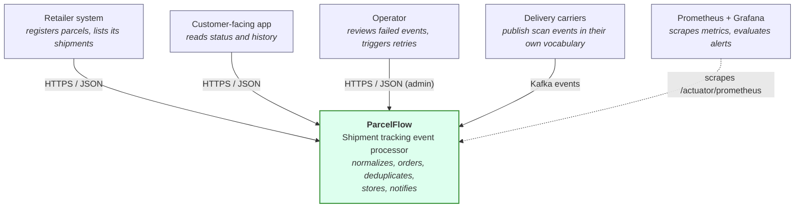
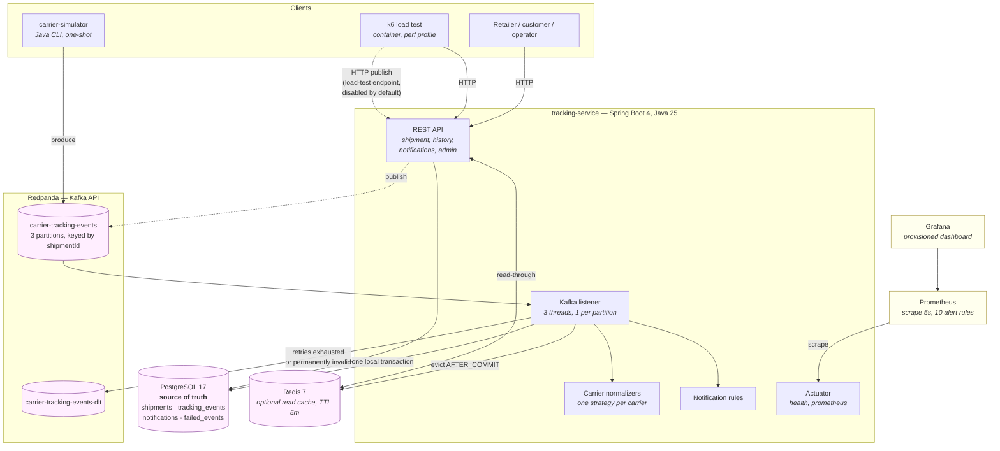
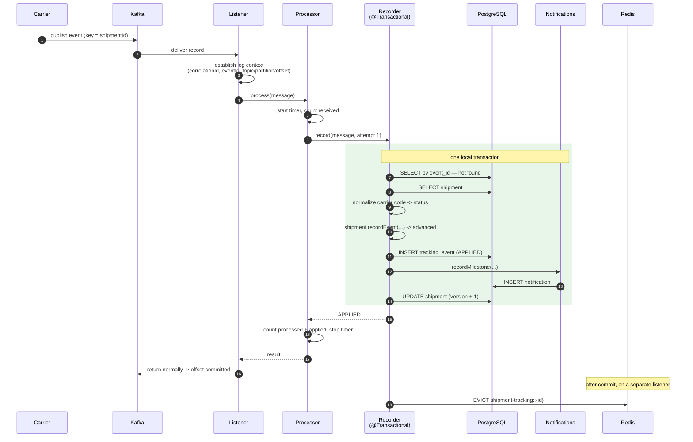
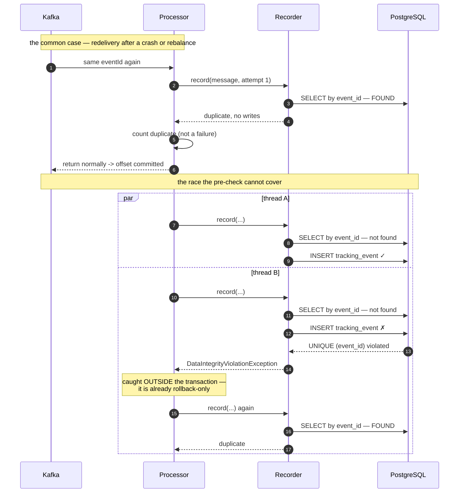
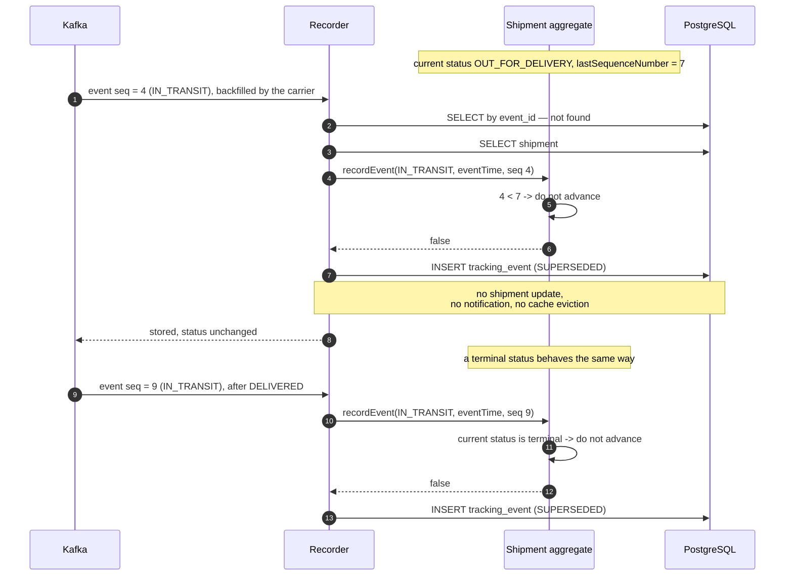
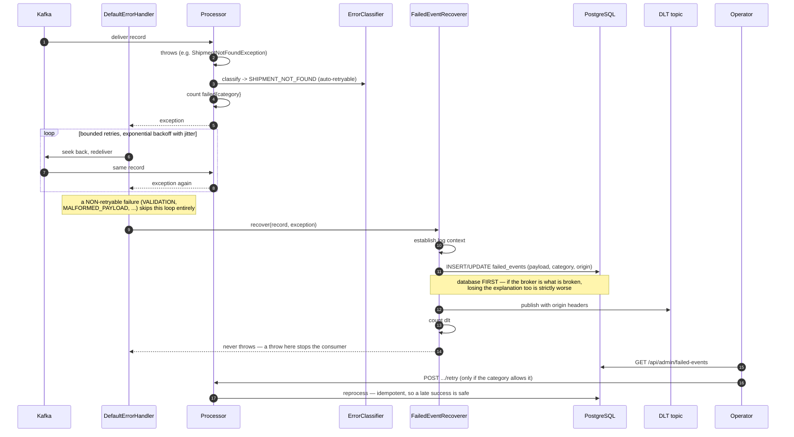

# Architecture

> ParcelFlow is an independent portfolio and training project. It is not affiliated with or based on
> proprietary systems from any delivery carriers or ecommerce retailers.

This document covers what exists and the decisions behind it. Everything described here is
implemented; where something is deliberately absent it says so.

The event pipeline has its own document: [event-processing.md](event-processing.md). Running the
system is [operations.md](operations.md). Measured behaviour under load is
[performance-results.md](performance-results.md).

Diagrams are in [section 12](#12-diagrams): system context, containers, and sequence diagrams for
the successful, duplicate, out-of-order and dead-letter paths. Technology choices are argued in
[section 13](#13-why-these-technologies), scaling in [section 14](#14-scaling),
single points of failure in [section 15](#15-single-points-of-failure-in-the-local-environment), and
the gap to a real deployment in [section 16](#16-what-would-change-in-a-production-deployment).

---

## 1. Shape of the system

Two deployables:

| Application | Role |
|---|---|
| **tracking-service** | Modular monolith. Owns the shipment REST API and the carrier event consumer. |
| **carrier-simulator** | Command-line producer of synthetic carrier events, with six reproducible scenarios covering normal, duplicate, out-of-order and invalid traffic. |

### Why one service and not several

The event pipeline's core step is: update the shipment, append tracking history, create a
notification record. Splitting those across services would mean either a distributed transaction or
an outbox and saga — a large amount of machinery bought with nothing, since all three writes target
the same database. Keeping them in one local transaction makes the interesting problems
(idempotency, ordering, concurrency) visible instead of burying them under coordination code.

The cost is that module boundaries are conventions rather than network boundaries. They are kept
honest by package structure and by never letting a controller reach into another module's internals.

### Module boundaries

```
ca.vm.parcelflow
├── shipment        the aggregate: entity, repository, service, REST API
├── tracking        carrier event ingestion, history, and the events endpoint
│   ├── domain          TrackingEvent, EventProcessingStatus
│   ├── messaging       Kafka listener and the wire contract
│   └── api             tracking history REST
├── carrier         carrier codes and per-carrier event normalizers
│   └── normalization   one strategy per carrier, plus the registry
│   ├── error           ErrorCategory and the classifier: one retry policy
│   └── failure         failed-event record, DLT recoverer, admin API
├── notification    milestone rules and notification records
├── infrastructure  framework wiring: Clock, OpenAPI, Kafka topics, cache, error handling
└── shared          cross-module API concerns: error handling, paging
```

Dependency direction: `tracking` → `carrier`, `shipment`, `notification`. Nothing depends on
`tracking`. `shared` and `infrastructure` are depended upon but depend on nothing in the domain.
`notification` never calls back into `tracking` — that would be the first sign the boundary is
rotting.

---

## 2. Data model

### `shipments` — implemented

| Column | Type | Notes |
|---|---|---|
| `shipment_id` | `UUID` | PK, assigned by the application before insert |
| `retailer_id` | `VARCHAR(64)` | |
| `customer_id` | `VARCHAR(64)` | Opaque retailer-side reference. Never logged, never returned by the API. |
| `tracking_number` | `VARCHAR(128)` | |
| `carrier_code` | `VARCHAR(32)` | Enum as string, not ordinal |
| `current_status` | `VARCHAR(32)` | Materialized from applied events |
| `estimated_delivery_date` | `DATE` | |
| `last_event_time` | `TIMESTAMPTZ` | Event time of the last **applied** event |
| `last_sequence_number` | `BIGINT` | Sequence of the last **applied** event |
| `version` | `BIGINT` | Optimistic lock |
| `created_at` / `updated_at` | `TIMESTAMPTZ` | |

Constraints and indexes:

- `UNIQUE (carrier_code, tracking_number)` — a tracking number is unique *within* a carrier, not
  globally. This is the authority for duplicate registration.
- `(retailer_id, created_at DESC)` — serves the retailer listing.
- `(retailer_id, current_status, created_at DESC)` — serves the same listing with `?status=`.

Two fields deserve explanation because they are not in the original data sketch:

**`last_sequence_number`.** Deciding whether an event is newer than the current state requires
knowing the last sequence number applied. Storing it on the shipment makes that decision a single
row read instead of a query against tracking history.

**Enums stored as strings.** `@Enumerated(EnumType.STRING)` throughout. Ordinals break the moment
someone inserts a constant in the middle of the enum, and they make the table unreadable in `psql`.

### `tracking_events` — implemented

| Column | Type | Notes |
|---|---|---|
| `id` | `BIGINT` identity | Surrogate PK. Narrow and monotonic, for an append-only table. |
| `event_id` | `UUID` | The carrier's id. `UNIQUE` — the database-level idempotency guarantee. |
| `shipment_id` | `UUID` | FK to `shipments`, `ON DELETE CASCADE`. |
| `tracking_number` | `VARCHAR(128)` | Denormalized; see below. |
| `carrier_code` | `VARCHAR(32)` | |
| `carrier_event_type` | `VARCHAR(64)` | The carrier's own code, as received. |
| `normalized_event_type` | `VARCHAR(32)` | ParcelFlow's reading of it. |
| `event_time` / `received_at` | `TIMESTAMPTZ` | Observed by the carrier / ingested by us. |
| `sequence_number` | `BIGINT` | The carrier's per-shipment counter. |
| `location` / `description` | text | Optional, free text. |
| `correlation_id` | `VARCHAR(64)` | Propagated from the producer. |
| `processing_status` | `VARCHAR(32)` | `APPLIED` or `SUPERSEDED`. |

Append-only and immutable: the entity has no setters and nothing updates a stored row. An event is a
statement about the past, so correcting one would mean rewriting history rather than appending to it.

**Why both event types are stored.** The normalized value drives the API and the shipment state; the
raw value is what makes a support conversation with the carrier possible, and what allows a mapping
bug to be re-run against stored history instead of lost.

**Why `tracking_number` is denormalized.** Carrier support queries arrive as "what happened to
SP123456?". Storing the number the carrier itself used means the lookup needs no join and still
works if the shipment record is later corrected.

**Why `shipment_id` is a plain UUID, not `@ManyToOne`.** An association would add lazy loading and
cascade semantics to an append-only table for no gain: the write path already holds the `Shipment`
it needs, and the read path never navigates back.

Indexes: `(shipment_id, event_time, sequence_number)` for the history endpoint including its sort,
`(tracking_number, event_time)` for support lookups, `(received_at DESC)` for operational queries
over the recent ingest stream.

### `notifications` — implemented

One row per milestone crossed: `notification_id`, `shipment_id`, `source_event_id`,
`notification_type`, `channel`, `status`, `created_at`. Records only; nothing is delivered.

The important part is `UNIQUE (shipment_id, source_event_id)`. Keeping the id of the causing event
turns "do not notify a customer twice for one scan" from a check the application has to remember
into a constraint the database enforces — which is what makes it hold under a race between two
consumer threads. Indexed on `(shipment_id, created_at, notification_id)`; the id is the last sort
key because notifications created in one transaction share `created_at` to the microsecond, and
without a tie-break they would page non-deterministically.

### `failed_events` — implemented

The durable record of an event that could not be processed: identifiers, the original `payload`, the
error category, a bounded error message, retry count, workflow status, and the original topic,
partition and offset.

`payload` is `TEXT`, not `JSONB`, on purpose: a payload that failed to deserialize is frequently not
valid JSON, and `JSONB` would reject the very rows most worth keeping. `event_id` is `UNIQUE` and
nullable — Postgres treats NULLs as distinct, so several unparseable payloads coexist while a named
event still gets exactly one row that accumulates its retry history.

There is deliberately no stack-trace column. A trace is unbounded, mostly framework frames, and
belongs in the log stream where it can be sampled and expired.

### `shipments.last_received_at` — added in Stage 3

The third level of the ordering rule needs something to compare against. See
[event-processing.md](event-processing.md#5-event-ordering).

---

## 3. The ordering decision

This is the heart of the project, and it is deliberately in the domain model rather than a service:
`Shipment.recordEvent(status, eventTime, sequenceNumber, now)`.

```
if current status is terminal        -> reject  (DELIVERED is sticky)
if no event applied yet              -> accept  (first event always wins)
if sequence numbers differ           -> accept iff incoming > last applied
else if event times differ           -> accept iff eventTime is after last applied
else                                 -> accept iff receivedAt is not before last applied
```

The third level was added in Stage 3. Its rationale and trade-off are in
[event-processing.md](event-processing.md#5-event-ordering).

A rejected event returns `false`. That is **not an error**: the event is still appended to tracking
history, it just does not move `currentStatus`. This is exactly the scenario in the brief — an older
`IN_TRANSIT` arriving after `OUT_FOR_DELIVERY` leaves the parcel `OUT_FOR_DELIVERY` while still
appearing in history.

### Why sequence number outranks event time

Event times come from handheld scanners whose clocks drift and which frequently stamp consecutive
scans with the same second. Sequence numbers are integers assigned by the carrier in the order it
actually observed the parcel. When the two disagree, the sequence number is the better witness. Event
time is kept as a tie-breaker for carriers that reuse a sequence number.

### Why statuses are not ranked

The obvious-looking alternative is to give each status an integer rank and let the higher rank win.
It is wrong. `DELAYED` and `DELIVERY_ATTEMPTED` are exception states that can occur at several points
in a journey, and `ARRIVED_AT_FACILITY` legitimately repeats at every sorting hub. Any total order
over these statuses is a false model. The only ordering property that genuinely belongs to a status
is terminality.

### Why `DELIVERED` is sticky

Carriers backfill scans. A parcel delivered at sequence 8 can receive an `IN_TRANSIT` scan stamped
sequence 12 hours later. Without a terminal rule the parcel would visibly un-deliver, which is worse
than dropping the event. ParcelFlow has no post-delivery states (no returns, no re-shipment), so the
rule is safe within its scope — and it is the first thing to revisit if returns are ever added.

---

## 4. Concurrency control

Two consumer threads can process events for the same parcel simultaneously. The shipment row is the
contended resource.

**Mechanism: JPA optimistic locking** via `@Version`. Each update carries
`WHERE shipment_id = ? AND version = ?`; the loser gets zero affected rows and Spring raises
`OptimisticLockingFailureException`.

Why optimistic rather than `SELECT ... FOR UPDATE`:

- Conflicts are rare. Two events for the *same parcel* arriving close enough to overlap is unusual;
  events for *different* parcels never contend. Paying a lock on every update to protect against a
  rare case is the wrong trade.
- Pessimistic locks held across an event-processing transaction create a queue of consumer threads
  behind one slow parcel, and open the door to deadlocks when lock order varies.
- The retry is safe. The read-decide-write cycle re-reads the shipment, re-runs the ordering
  decision, and writes again. Because `recordEvent` is a pure function of (current state, incoming
  event), replaying it after a conflict produces the correct answer — the same property that makes
  the whole pipeline idempotent.

The retry is bounded — `parcelflow.processing.max-optimistic-lock-retries`, default 3 — and each
attempt runs in a **fresh** transaction. Both properties matter. An unbounded loop under sustained
contention is a livelock that consumes a consumer thread forever; giving up hands the record back to
the Kafka error handler, whose backoff spaces the next attempt out. And retrying inside the failed
transaction would be a no-op, because the persistence context is already dead once
`OptimisticLockingFailureException` is thrown — which is why the retry crosses a bean boundary from
`TrackingEventProcessor` to `TrackingEventRecorder` rather than looping in place.

What this protects against is not a single instance. Kafka keys every event by shipment id, so one
parcel's events reach one consumer thread in order and cannot overlap. The contended case is two
instances during a rebalance, one still holding a partition the other has been assigned.

---

## 5. Transaction boundaries

Transactions begin and end in `ShipmentService`, never in a controller and never in the domain
model. `spring.jpa.open-in-view` is `false`, so no transaction or connection is held open for the
duration of an HTTP response — a request that serializes slowly cannot hold a pooled connection
hostage.

One detail worth pointing out: `registerShipment` uses `saveAndFlush`, not `save`. With `save`, the
`INSERT` is deferred to commit, which happens *after* the service method returns — so the unique
constraint violation would surface outside the `try` block and the client would get a `500` instead
of a `409`. Flushing inside the transaction puts the exception where it can be translated.

Event ingestion has its boundary in `TrackingEventRecorder.record`, which is one transaction
covering the duplicate check, the history insert, the shipment update and the notification. There is
no window in which a parcel shows a status that no stored event justifies, or a customer is notified
about an event that was rolled back. All of it targets the same database, so this needs no
distributed coordination — the concrete payoff of the single-service decision in section 1.

The shipment is a managed entity inside that transaction, so `recordEvent` flushes on commit under
`@Version` guard. There is no explicit `save` call for it and therefore no second write path to keep
in sync.

**Three things deliberately sit outside that transaction**, and each would be a bug inside it:

| Work | Where | Why not inside |
|---|---|---|
| Optimistic-lock retry | `TrackingEventProcessor`, loop | The persistence context is dead once the exception is thrown; a retry needs a new transaction, and a `@Transactional` method cannot start one by calling itself. |
| Duplicate detection on constraint violation | `TrackingEventProcessor`, catch | Hibernate marks the transaction rollback-only at flush; catching and continuing yields `UnexpectedRollbackException` at commit. |
| Failed-event persistence | `FailedEventStore`, `REQUIRES_NEW` | It runs after the processing transaction rolled back. Joining it would delete the record of the failure along with the failure. |
| Cache eviction | `ShipmentCacheInvalidator`, `AFTER_COMMIT` | Evicting mid-transaction lets a concurrent reader repopulate from pre-commit state, leaving an entry that is wrong and that nothing will evict again. |

The manual retry flow is the same principle at a larger scale: claim, reprocess, record the outcome —
three separately committing steps, because one transaction around all of them would roll back the
retry-count increment whenever the retry failed, losing the record of the attempt.

---

## 6. API design

- **RFC 9457 problem details** for every error, with a stable `type` URI per error kind so clients
  branch on a URI rather than a message string.
- **Pagination as explicit validated parameters** (`page`, `size` with `@Min`/`@Max`) rather than an
  injected `Pageable`. The page-size ceiling becomes part of the published contract and appears in
  the OpenAPI document, instead of depending on a framework default that a `size=100000` request
  might slip past.
- **Owned pagination envelope** (`PageResponse`) rather than serializing Spring Data's `Page`, whose
  JSON shape is an implementation detail that has changed across versions.
- **`customerId` is write-only.** Accepted at registration, never returned, never logged. It is also
  excluded from `Shipment.toString()` so it cannot leak into a log line by accident, which is
  verified by a test.
- **No business logic in controllers.** Controllers bind, delegate, and map to a response record.
- **Immutable records** for every DTO.
- **Injected `Clock`.** Nothing in the domain calls `Instant.now()`, so ordering behaviour is
  testable at exact timestamps.
- **Both readings exposed.** A tracking history entry carries `normalizedEventType` *and*
  `carrierEventType`, so a consumer can render the normalized value while a support engineer sees
  the raw scan. The internal surrogate key is not exposed — `eventId` is the identifier that means
  something outside the process.
- **Fixed ordering on history.** The events endpoint does not accept a sort parameter. The order is
  part of what the endpoint means, and the composite index is built for exactly that order.

---

## 7. Schema management

Flyway owns the schema; Hibernate runs with `ddl-auto: validate` in both production and tests. A
mismatch between a migration and an entity mapping fails at startup rather than being silently
papered over by `ddl-auto: update`.

Migrations are added incrementally per stage — `V1__create_shipments.sql`,
`V2__create_tracking_events.sql`, and `notifications` in Stage 3 — rather than written as one upfront
schema. That is the discipline a real deployment needs, where the previous migration has already run
in production and cannot be edited.

---

## 8. Deployment

Multi-stage Docker build: a JDK 25 image compiles, a JRE 25 image runs, and the container runs as a
non-root user. Build scripts are copied before source so the Gradle distribution and dependency cache
sit in a layer that survives source edits.

`-XX:MaxRAMPercentage=75` rather than a fixed `-Xmx` so the heap tracks whatever memory limit the
container is given. `-XX:+ExitOnOutOfMemoryError` makes the orchestrator restart a process that has
lost its heap, instead of leaving it thrashing.

Compose health checks gate startup: the service waits for PostgreSQL's `pg_isready -U ... -d ...`
(the flags matter — without them it reports ready before the database exists), and the service's own
check hits `/actuator/health/readiness` rather than a TCP port, so it reports healthy only after
Flyway has migrated and the datasource answers.

---

## 9. Messaging

**Redpanda, not Apache Kafka.** Same protocol, same client library, same consumer semantics, but a
single container with no ZooKeeper or KRaft bootstrap and a roughly one-second start. That makes a
broker-backed integration test cheap enough to run on every build, and the same image is used in
Compose and in Testcontainers so tests and the local stack exercise the same broker.

**Topics are declared as `NewTopic` beans**, created by Spring's `KafkaAdmin` at startup before any
listener consumes. Relying on broker auto-create would give topics the broker's default partition
count, silently breaking the partitioning that per-shipment ordering depends on. Declaring them also
keeps the topology in source rather than in someone's shell history.

**Three partitions, keyed by shipment id.** All events for one parcel land on one partition and are
delivered to one consumer in production order. Ordering is guaranteed per parcel, never globally —
which is exactly the guarantee the domain needs, and why the out-of-order rules exist for everything
that crosses parcels or crosses a producer retry.

**`ack-mode: record`.** The offset is committed after the listener method returns normally, one
record at a time. Manual acknowledgement was considered and rejected: it adds a way to silently lose
an offset commit while buying nothing, since the unit of work is exactly one record and the
processor's transaction has already committed by the time the method returns.

The offset commits *after* the database transaction, so a crash in that gap causes redelivery. That
is the correct trade — at-least-once with a duplicate is recoverable, at-most-once with a lost
delivery scan is not. Stage 3 closes the loop by making reprocessing idempotent.

**Deserialization is pinned, not negotiated.** `spring.json.use.type.headers` is `false` and
`spring.json.value.default.type` names the class. Trusting the producer's type header means a
producer chooses which class the consumer instantiates. `spring.json.trusted.packages` names one
package; never `*`.

`ErrorHandlingDeserializer` wraps the JSON deserializer so an unparseable payload becomes a failed
record the container can handle, rather than an exception inside the poll loop that stalls the
partition forever.

---

## 10. Reliability

### Idempotency

Two layers. A pre-check inside the transaction handles the common redelivery cheaply; `UNIQUE
(event_id)` handles the race the pre-check cannot, where two threads both read "not present". The
loser's constraint violation is caught outside the transaction and turned into a successful no-op.

The database constraint is the guarantee, not the pre-check. An in-memory set dies in exactly the
crash that produces duplicates, and a Redis-based check has no atomicity with the PostgreSQL write —
full reasoning in
[event-processing.md](event-processing.md#why-an-in-memory-set-or-redis-only-idempotency-is-not-enough).

Notifications get the same treatment through `UNIQUE (shipment_id, source_event_id)`.

### Error classification

`ErrorCategory` answers two independent questions per failure — is it worth retrying automatically,
and could a human or a deploy make it succeed — and `ProcessingErrorClassifier` is the single source
of truth. The Kafka error handler builds its not-retryable list from the same declaration the stored
record and the manual retry endpoint classify against, so the three cannot drift apart. The full
table is in [event-processing.md](event-processing.md#7-error-classification).

### Dead letter flow

Bounded exponential backoff with jitter for retryable failures; non-retryable ones skip the retries
entirely. When the budget is gone, `FailedEventRecoverer` writes a `failed_events` row **first** and
publishes to the DLT **second** — if the broker is what is broken, losing the explanation as well as
the message is strictly worse than losing only the message. Neither step may throw: an exception from
the recoverer makes the container retry the batch, and a poison record then stops the consumer for
good.

The topic and the table are complements. The topic holds the message and is what you replay in bulk;
the row holds the explanation, the retry history and the workflow state.

### Cache consistency

PostgreSQL is the source of truth; Redis holds derived copies with a TTL. Eviction happens on
`AFTER_COMMIT` and only for events that actually changed the shipment. Every cache operation is
best-effort via a `CacheErrorHandler`, Redis is excluded from the readiness probe, and the cache can
be switched off entirely with `parcelflow.cache.enabled=false` — which is how most of the test suite
runs, and therefore the standing proof that correctness does not depend on it. Details in
[event-processing.md](event-processing.md#9-redis-consistency-model).

---

## 11. Known limitations

- **One consumer instance.** `concurrency: 3` gives one thread per partition within a single
  instance. Processing is idempotent enough for a rebalance to be safe, but that is argued rather
  than demonstrated: there is no multi-instance rebalance test.
- **The event contract is declared twice**, once per module, deliberately — but the two copies are
  kept in step by hand. A schema registry is the real fix.
- **No bulk DLT replay.** Retry is one event at a time through the admin API.
- **`/api/admin/**` is unauthenticated.** Out of MVP scope; the path prefix exists so the subtree can
  be secured with one rule.
- **`sequenceNumber` is trusted.** The fallback to `eventTime` handles a carrier omitting it, but not
  a carrier resetting it mid-journey.
- **The third ordering level depends on arrival order**, so two genuinely ambiguous events replayed
  in the opposite order settle differently. Bounded by the `event_id` constraint, which excludes
  exact replays.
- **Notification records are never dispatched.** By design; nothing moves them out of `PENDING`.

---

## 12. Diagrams

### 12.1 System context

Who talks to ParcelFlow, and about what.



Carriers are simulated by `carrier-simulator`; there is no integration with any real carrier. The
notification records ParcelFlow produces are never dispatched — nothing moves them out of `PENDING`,
by design.

### 12.2 Containers

Everything that runs, and what each one is for.



### 12.3 A successful event



The offset commits **after** the transaction. That ordering is the source of the duplicate case
below, and it is the right way round: a duplicate is recoverable, a lost scan is not.

### 12.4 A duplicate event



Two mechanisms, one guarantee: the pre-check is an optimisation, the constraint is the contract.

### 12.5 An out-of-order event



The late event is kept because it is a real observation. What it does not get to do is move the
parcel backwards, or notify a customer about a milestone their parcel passed hours ago.

### 12.6 Retry and dead letter



---

## 13. Why these technologies

The decisions that would be the first questions in a review.

### Why a modular monolith

Because the unit of work is one local transaction. Updating the shipment, appending history and
creating the notification have to happen together; splitting them across processes replaces a
`COMMIT` with a saga, an outbox and a set of compensating actions — a large amount of machinery
bought with nothing, because all three writes target the same database anyway.

The interesting problems in this domain are idempotency, ordering and concurrency. Distributing the
system does not make them easier; it adds coordination code that buries them. What a modular
monolith gives up is enforcement: module boundaries are conventions kept honest by package structure
and dependency direction rather than by a network. The boundaries are drawn where a service boundary
would go, so `notification` could be extracted if it ever earned its own deployment — and the fact
that it does not call back into `tracking` is what keeps that possible.

### Why Kafka (Redpanda locally)

A carrier feed is a stream of facts about parcels, produced by systems that are not asking anything
of us. That is a log, not a request:

* **The consumer's availability is decoupled from the producer's.** A carrier publishing while
  ParcelFlow is restarting must not lose scans. With `auto-offset-reset: earliest` and committed
  group offsets, everything published during an outage is consumed afterwards.
* **Per-key ordering is a first-class guarantee.** Keying by shipment id means one parcel's scans land
  on one partition and reach one consumer in production order. A queue with competing consumers gives
  no such guarantee, and ordering per parcel is exactly the guarantee this domain needs — global
  ordering is neither needed nor affordable.
* **Replay is possible.** Being able to reset a consumer group and reprocess is what makes debugging
  an ingestion bug tractable, and it is only safe because processing is idempotent. The two
  properties go together.
* **Partitions are the scaling unit.** Throughput grows by adding partitions and consumers without
  changing the processing model.

**Redpanda in Compose and in tests**, not Apache Kafka: same protocol, same client library, same
consumer semantics, one container, no ZooKeeper or KRaft bootstrap, about a one-second start. That
makes a broker-backed integration test cheap enough to run on every build, and tests and the local
stack exercise the same broker. Nothing in the code is Redpanda-specific.

### Why PostgreSQL is the source of truth

Because the guarantees this system makes are database guarantees:

* **Transactions.** Three writes commit together or not at all.
* **Unique constraints.** Idempotency is `UNIQUE (event_id)`. Notification-once is
  `UNIQUE (shipment_id, source_event_id)`. Duplicate registration is
  `UNIQUE (carrier_code, tracking_number)`. Every one of these holds under a race that application
  code would lose.
* **Optimistic locking.** A version column is what turns a lost update into a detected conflict.
* **Durability.** A parcel scan that was acknowledged must survive a restart.

Relational rather than document-oriented because the data is relational — shipments have events have
notifications — and the queries are relational: a parcel's history ordered by sequence, a retailer's
shipments filtered by status.

### Why Redis is optional

Because a cache that can take the service down is not a cache.

Redis holds one thing: the tracking response for `GET /api/shipments/{id}`, derived entirely from a
PostgreSQL row, with a five-minute TTL. It is never in the write path. Every operation is best-effort
through a `CacheErrorHandler` that swallows and logs; Redis is excluded from readiness; the whole
cache can be switched off with `parcelflow.cache.enabled=false`.

That last one is the point. The claim "the service is correct without Redis" is only worth making if
running it that way is a supported configuration — so most of the test suite runs with the cache
disabled, and that is the standing proof rather than an assertion in a document. Stopping Redis in
the running stack is [experiment 2](operations.md#experiment-2--stop-redis): readiness stays UP,
reads stay correct, latency rises, and a counter makes the swallowed failures visible.

---

## 14. Scaling

**The read path** is stateless: more instances behind a load balancer. Redis absorbs repeated reads
of hot parcels; a read replica would take the history queries if they became the constraint.

**The ingest path** scales by partitions. Events are keyed by shipment id, so consumers can be added
up to the partition count without breaking per-parcel ordering. Today: three partitions, one
instance, `concurrency: 3` — one thread per partition. The next step is more partitions than
instances and instances that can come and go, which a rebalance makes safe *because* reprocessing is
idempotent.

Two caveats worth stating:

* **Adding partitions to an existing topic re-maps keys.** A parcel mid-journey can move to a
  different partition, so its in-flight events can be reordered relative to each other. The ordering
  rules absorb that, which is a large part of why they exist rather than relying on partition order
  alone.
* **The multi-instance safety argument is argued, not demonstrated.** There is no rebalance test. It
  is the first thing worth building next.

**The write path** is the real ceiling: one transaction per applied event. The first move would be
batching within a partition — several events for one parcel in one transaction — rather than a bigger
database. Beyond that, partitioning `tracking_events` by time keeps the hot set small, since nobody
queries last year's scans.

**What does not scale by adding instances** is anything that assumes a single process. There is
nothing like that here, which is the entire reason the idempotency guarantee lives in the database
rather than in memory.

Measured behaviour, and what it does and does not show, is in
[performance-results.md](performance-results.md).

---

## 15. Single points of failure in the local environment

Everything here is single-instance, because it is a laptop stack. Worth naming so nobody mistakes
the topology for a design:

| Component | Failure mode | Effect | Mitigated by |
|---|---|---|---|
| **PostgreSQL** (one container, one volume) | Down or corrupt | Total: no reads, no writes, ingest fails and retries | Nothing. Readiness reports DOWN; events are retried and then dead-lettered |
| **Redpanda** (one broker, replication factor 1) | Down | No ingest; the API still serves reads | Nothing. Offsets survive, so consumption resumes; a lost volume loses unconsumed events |
| **tracking-service** (one instance) | Down | Total | Nothing. Compose restarts it; in-flight records are redelivered |
| **Redis** (one container, no persistence) | Down | Read latency only | **By design.** Excluded from readiness, best-effort operations, cache disable-able |
| **Prometheus / Grafana** (one each) | Down | No metrics or dashboards; the service is unaffected | Nothing. Monitoring is not in the request path |
| **Docker host** | Down | Everything | Nothing. It is one laptop |

The only one of these that is *designed* to be tolerated is Redis, and that tolerance is real and
verified. The rest are single instances because a portfolio stack that ran three brokers and a
Patroni cluster would demonstrate Compose skills rather than design.

---

## 16. What would change in a production deployment

Ordered by what would go first.

**Availability and data.** PostgreSQL with a replica and automated failover, PITR backups with
restores actually tested. A Kafka cluster with replication factor 3, `min.insync.replicas=2`, and a
DLT with the same durability as the main topic. Several service instances across availability zones,
behind a load balancer that consults the readiness probe.

**Security.** Authentication and an operator role in front of `/api/admin/**`. TLS everywhere,
including to the broker, with SASL. Secrets from a secret manager rather than a Compose file.
Management endpoints on a port that is not publicly routed. A schema registry, so the event contract
stops being two hand-synchronised copies.

**Operations.** Alertmanager with routing, silences and an on-call rotation — rules with no receiver
are documentation. A trace backend (OTLP to Tempo or Jaeger) with sampling well below 100%; today
spans are created and dropped. Log shipping to something that indexes the ECS fields, with retention.
Exporters for PostgreSQL, Redis and the broker, so the dashboard shows the dependencies and not only
the application's view of them.

**Capacity and cost.** Partition count sized from measured throughput rather than chosen. Connection
pool sized against the database's real limit. Metric retention and cardinality budgeted; a histogram
per outcome is cheap here and is not free at a thousand instances. Time-partitioned
`tracking_events` with an archival policy.

**Correctness at scale.** A multi-instance rebalance test in CI. Bulk DLT replay, because
one-at-a-time retry does not survive an incident that dead-letters ten thousand events. A dispatcher
that actually sends the notifications, with its own idempotency — sending is the part where
at-least-once starts costing a customer something.

Multi-region is a bigger question than any of these, and is answered honestly in the
[interview guide](interview-guide.md#310-what-would-you-change-for-a-real-multi-region-production-system):
the current design assumes one write region, and its guarantees — a local transaction, a unique
constraint, an optimistic-locked row — are single-region reasoning.
