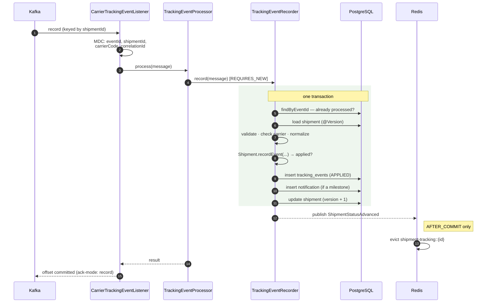
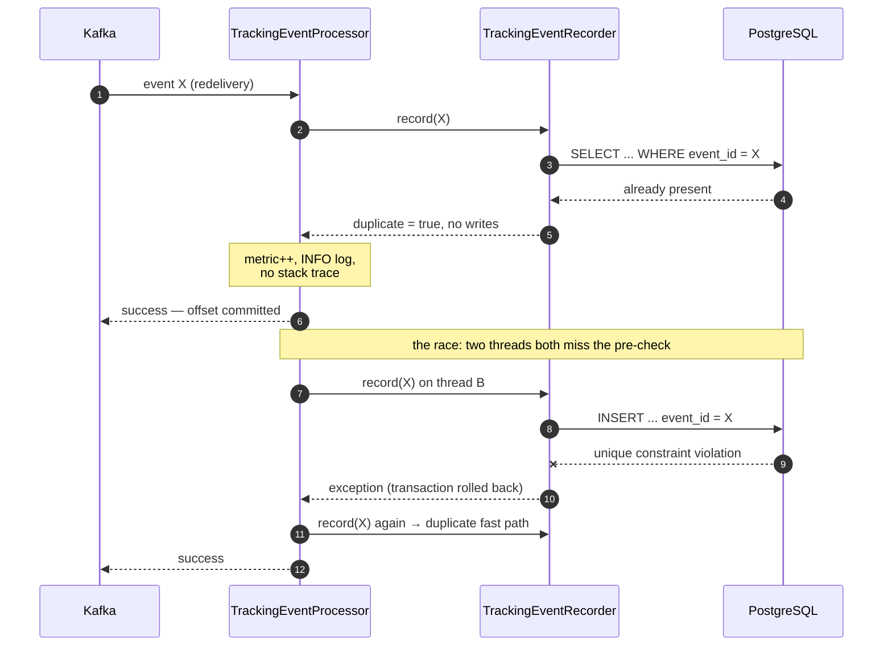
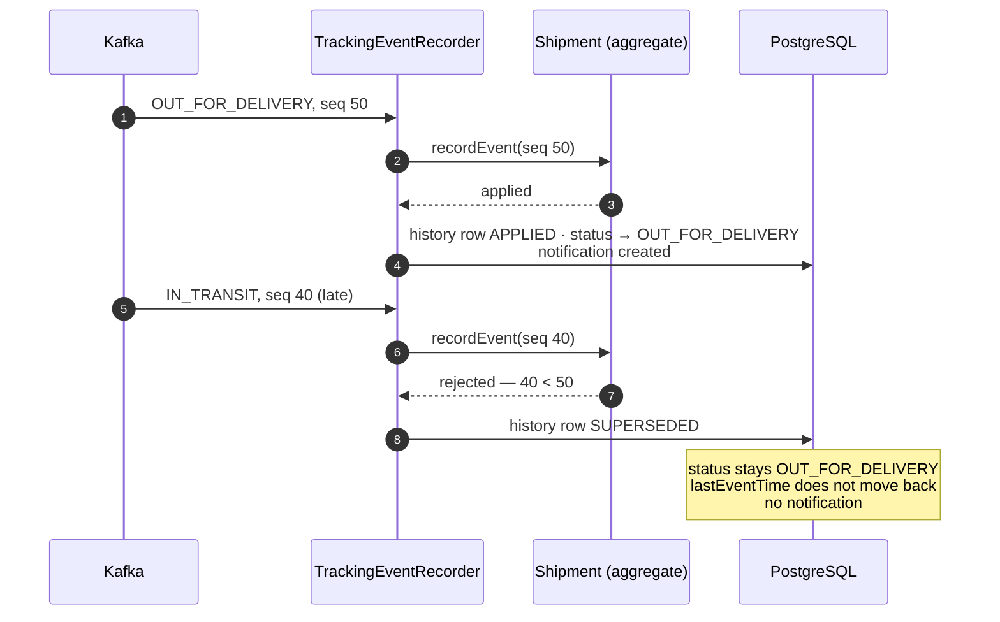
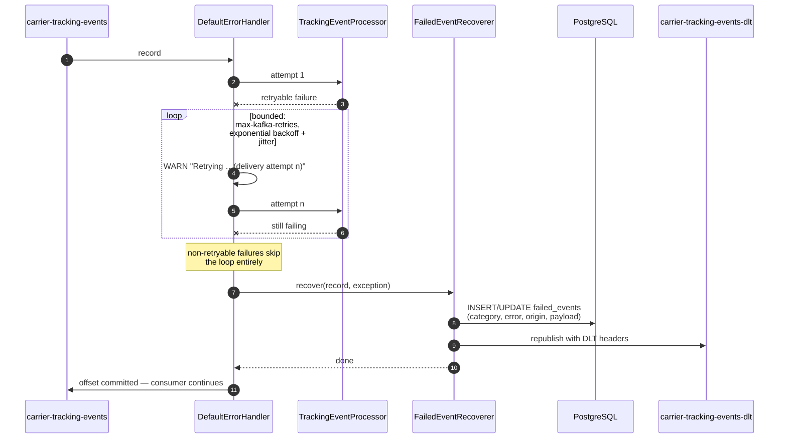
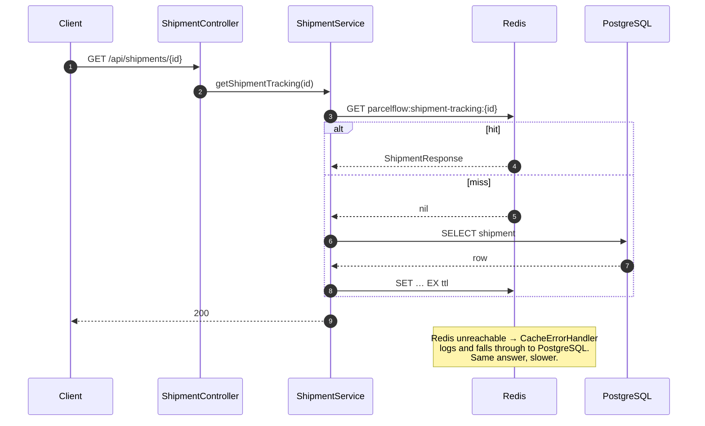

# Event processing

> ParcelFlow is an independent portfolio and training project. It is not affiliated with or based on
> proprietary systems from any delivery carriers or ecommerce retailers.

How a carrier scan becomes a status change, and what happens when it cannot.

---

## 1. The event contract

Carrier events are published to `carrier-tracking-events` as JSON, keyed by shipment id.

| Field | Type | Required | Notes |
|---|---|:---:|---|
| `eventId` | UUID | ✔ | The carrier's identifier for this scan. Unique key of the history table, and the basis of idempotency. |
| `schemaVersion` | int | ✔ | Currently `1`. Any other value is rejected as permanently invalid. |
| `shipmentId` | UUID | ✔ | Must resolve to a registered shipment. |
| `trackingNumber` | string ≤128 | ✔ | Stored as sent, on the event row. |
| `carrierCode` | enum | ✔ | `SWIFTPOST`, `NORDEX`, `PACIFICA`, `METROLINK`. Must match the shipment. |
| `eventType` | string ≤64 | ✔ | The carrier's **own** code, not a normalized one. |
| `eventTime` | ISO-8601 instant | ✔ | UTC. When the carrier observed the scan. |
| `sequenceNumber` | long > 0 | ✔ | The carrier's per-shipment counter. Primary ordering authority. |
| `location` | string ≤255 | | Free text. |
| `description` | string ≤512 | | Free text. |
| `correlationId` | string ≤64 | ✔ | Propagated from the producer; ties a journey together across services. |

```json
{
  "eventId": "cc512789-b504-4f1b-b1ad-6c568f9823df",
  "schemaVersion": 1,
  "shipmentId": "1d485737-0830-4fe9-a083-45a40c7f26e2",
  "trackingNumber": "SP100000000042",
  "carrierCode": "SWIFTPOST",
  "eventType": "SP_OFD",
  "eventTime": "2026-08-05T20:07:08.084327625Z",
  "sequenceNumber": 7,
  "location": "Ashgrove",
  "description": "Out for delivery",
  "correlationId": "08ad3a97-8e5c-4b12-8ee5-80938efa139a"
}
```

### The contract is not a shared class

`CarrierTrackingEventMessage` is declared twice: once in `tracking-service`, once in
`carrier-simulator`. A carrier does not compile against your classes — the contract between you is
the JSON document and the `schemaVersion` that describes it. Sharing a module would make a schema
change look like a compile step instead of a deployment ordering problem, which is the exact problem
`schemaVersion` exists to manage. The cost is that the two declarations must be kept in step by
hand, and that cost is the argument for the schema registry under future improvements.

### Why the consumer ignores type headers

`spring.json.use.type.headers` is `false` and the deserializer is pinned to one class via
`spring.json.value.default.type`. Spring Kafka's JSON serializer will otherwise stamp the producer's
class name into a header and the consumer will instantiate whatever it names — a producer choosing
which class the consumer constructs is a deserialization gadget in waiting.
`spring.json.trusted.packages` names one package. Never `*`.

---

## 2. Normalization

One `CarrierEventNormalizer` bean per carrier, discovered by Spring and indexed by
`CarrierEventNormalizers`. Adding a carrier is a new class; there is no switch statement and no
registration list to update.

| Normalized | SwiftPost | Pacifica |
|---|---|---|
| `LABEL_CREATED` | `SP_CREATED` | `MANIFESTED` |
| `PICKED_UP` | `SP_PICKUP` | `COLLECTED` |
| `IN_TRANSIT` | `SP_TRANSIT` | `MOVING` |
| `ARRIVED_AT_FACILITY` | `SP_DEPOT` | `AT_TERMINAL` |
| `OUT_FOR_DELIVERY` | `SP_OFD` | `COURIER_ROUTE` |
| `DELAYED` | `SP_DELAY` | `EXCEPTION_DELAY` |
| `DELIVERY_ATTEMPTED` | `SP_ATTEMPT` | `DELIVERY_FAILED` |
| `DELIVERED` | `SP_DELIVERED` | `COMPLETE` |

Two Pacifica mappings show why this is not a string transform: `DELIVERY_FAILED` is an *attempt*,
not a terminal failure, and `COMPLETE` means delivered, which nothing in the string suggests.

`NORDEX` and `METROLINK` are valid carrier codes with no normalizer, producing
`UnsupportedCarrierException` — deliberately distinct from `UnknownCarrierEventTypeException`. The
first is a configuration gap to fill; the second is a message to investigate.

`ShipmentStatus` is reused as the normalized event type rather than declaring a parallel enum with
the same eight constants, which would need a mapping function that could only ever be the identity.

---

## 3. The pipeline



**Both writes are one transaction.** History, shipment status and notification either all land or
none do, so a parcel never shows a status no stored event justifies, and a customer is never
notified about an event that was rolled back. All three target the same database, so this needs no
distributed coordination — the main reason ingestion was not split into its own service.

**The offset commits after the transaction.** If the process dies in that gap the record is
redelivered, which is why processing has to be idempotent. At-least-once with a duplicate is
recoverable; at-most-once with a lost delivery scan is not.

**Ordering is per parcel, not global.** Producers key every event by shipment id, so all events for
one parcel reach one consumer in production order. `concurrency: 3` runs one thread per partition;
events for different parcels have no ordering relationship and need none.

### Why the processor and the recorder are separate beans

`TrackingEventProcessor` holds no transaction. Everything it does — retrying, and turning a
constraint violation into a duplicate — must happen *outside* the transaction that failed, because
both conditions arrive only after that transaction is already marked rollback-only. Catching a
`DataIntegrityViolationException` inside `@Transactional` and carrying on produces an
`UnexpectedRollbackException` at commit. And a `@Transactional` method cannot start a fresh
transaction by calling itself: self-invocation bypasses the proxy, so the retry has to cross a bean
boundary to get one.

---

## 4. Idempotency



Two layers, and both are needed:

1. **A pre-check** inside the transaction. Handles the overwhelmingly common case — Kafka
   redelivered a record whose transaction already committed — without provoking a constraint
   violation, which would cost a rolled-back transaction and a stack unwind for an expected event.
2. **`UNIQUE (event_id)`** in PostgreSQL. Handles the race the pre-check cannot: two consumer
   threads both read "not present" and both insert. One wins; the loser's violation is caught by the
   orchestrator and turned into a successful no-op.

A duplicate is a **success**, not a failure. The work was already done. It is logged at INFO with no
stack trace: printing a trace for an expected condition teaches operators to ignore traces.

### Why an in-memory set or Redis-only idempotency is not enough

- **An in-memory set dies with the process.** The failure mode that produces duplicates in the first
  place is a crash between the database commit and the offset commit — precisely the moment the set
  is lost. It also does not exist across instances, so a rebalance moving a partition to another pod
  sees an empty set.
- **Redis is a separate system that can be down, and this one is explicitly allowed to be.** An
  idempotency check that fails open lets duplicates through; one that fails closed makes Redis a
  hard dependency of ingestion, which contradicts the whole cache design. There is also no
  atomicity between "SETNX in Redis" and "INSERT in PostgreSQL" — a crash between them leaves a key
  claiming work that was never done, and the event is lost forever.
- **The database constraint has neither problem.** The uniqueness check and the write are the same
  atomic operation in the same system that holds the data, so there is no window to crash in.

Notifications get the same treatment: `UNIQUE (shipment_id, source_event_id)` is what actually
prevents notifying a customer twice, with an application-level pre-check in front of it as an
optimization.

---

## 5. Event ordering

The rule lives in `Shipment.recordEvent`, in three levels. The first level that can decide, decides.

| Level | Compare | Rationale |
|---|---|---|
| 1 | `sequenceNumber` | An integer assigned by one system in the order it observed the parcel. |
| 2 | `eventTime` | Used when sequence numbers are equal. Scanner clocks drift, so this is second. |
| 3 | `receivedAt` | Used when both are equal. Always resolves for the incoming event: last received wins. |

Plus one status-based rule: **`DELIVERED` is terminal.** No later event moves a delivered parcel,
because carriers backfill scans and a parcel that visibly un-delivers is worse than a dropped event.



### Trade-offs

**Level 3 makes the outcome depend on arrival order.** Two *distinct* events sharing a sequence
number and an event time are either carrier corruption or a correction — a carrier re-reporting the
same scan slot with a fixed status — and last-received-wins is what a correction needs. It is
deterministic given arrival order, but only given arrival order: replay them in the opposite order
and they settle differently. Acceptable because an exact replay of the *same* event is already
excluded by the `event_id` constraint, so this path is reachable only from genuinely different
events the carrier failed to distinguish.

**This is deliberately not a state machine.** Carriers legitimately move parcels backwards — a
delivery attempt returns a parcel to a facility, a mis-sorted parcel goes back to a hub — and a
transition table would reject those as invalid, losing real observations to defend a model of the
network that is not true. The only status-based rule is terminality, and that one is documented,
narrow, and the first thing to revisit if returns are ever added.

**Superseded is not failure.** The event is stored, marked `SUPERSEDED`, and returned by
`GET /api/shipments/{id}/events`. A support engineer can see the late scan a customer is asking
about even though it never changed the displayed status. What a superseded event does *not* do is
notify: telling a customer their delivered parcel is out for delivery is worse than saying nothing.

---

## 6. Concurrency

`@Version` on the shipment row. Each update carries `WHERE shipment_id = ? AND version = ?`; the
loser gets zero affected rows and Spring raises `OptimisticLockingFailureException`.

The processor retries a **bounded** number of times (`parcelflow.processing.max-optimistic-lock-retries`,
default 3), each attempt in a **fresh transaction** that re-reads the shipment and re-runs the
ordering decision against the state that actually won. That is safe because `recordEvent` is a pure
function of (current state, incoming event): replaying it after a rollback produces the correct
answer, which is the same property that makes the whole pipeline idempotent.

The bound matters. An unbounded loop under sustained contention is a livelock that consumes a
consumer thread forever. Giving up hands the record back to the Kafka error handler, whose backoff
spaces the next attempt out instead of hammering the row.

Note what Kafka's partitioning already does: every event for one parcel shares a partition key, so
one consumer thread handles them in order and **concurrent updates to a single shipment cannot arise
from a single instance**. The path this protects is two instances during a rebalance, one still
holding a partition the other has been assigned — which is why the concurrency test drives the
processor directly from eight threads rather than through Kafka.

---

## 7. Error classification

Every failure maps to an `ErrorCategory` with two independent answers.

| Category | Auto-retry | Manual retry | Typical cause |
|---|:---:|:---:|---|
| `MALFORMED_PAYLOAD` | ✖ | ✖ | Payload could not be deserialized |
| `VALIDATION` | ✖ | ✖ | Missing field, constraint violation, unknown `schemaVersion` |
| `UNKNOWN_EVENT_TYPE` | ✖ | ✖ | Carrier sent a code with no mapping |
| `CARRIER_MISMATCH` | ✖ | ✖ | Event's carrier disagrees with the shipment's |
| `UNSUPPORTED_CARRIER` | ✖ | ✔ | No normalizer registered — a deploy fixes it |
| `SHIPMENT_NOT_FOUND` | ✔ | ✔ | See below |
| `CONCURRENCY_CONFLICT` | ✔ | ✔ | Two threads updated one shipment |
| `INFRASTRUCTURE` | ✔ | ✔ | Database or dependency temporarily unavailable |
| `UNKNOWN` | ✖ | ✔ | Unrecognised |

Two answers rather than one, because "will re-running the same bytes seconds later work?" and "could
it work after a human or a deployment changes something?" have different answers. A carrier without
a normalizer becomes processable once the normalizer ships; a payload with a missing field never
does.

**`UNKNOWN` is not auto-retried.** An unclassified failure is as likely to be a bug that will fail
identically forever as it is to be transient, and an operator looking at the failed-event record can
decide better than a backoff policy can. Blanket-retrying every `RuntimeException` means a malformed
payload consumes the full backoff budget on every redelivery while never having any chance.

**`SHIPMENT_NOT_FOUND` is retryable — a deliberate project policy.** A carrier's first scan genuinely
can beat the retailer's registration call, and a few hundred milliseconds of backoff resolves that
race cheaply. When it is instead a bad shipment id, the bounded retries expire and the event is dead
lettered. The cost of being wrong is about a second of backoff; the cost of the opposite default is
losing the first scan of a real parcel.

`ProcessingErrorClassifier` is the single source of truth: the Kafka error handler builds its
not-retryable list from the same declaration the failed-event record and the manual retry endpoint
classify against, so the three cannot drift into disagreeing.

---

## 8. Retry and the dead letter queue



Configured by `parcelflow.processing.*`: `max-kafka-retries`, `retry-initial-backoff`,
`retry-backoff-multiplier`, `retry-max-backoff`. Jitter is applied so a broker hiccup affecting many
records does not have every consumer retrying in lockstep.

**The database write comes before the DLT publish, deliberately.** If the broker is the thing that is
broken, the publish is exactly what will fail — and losing the explanation as well as the message is
strictly worse than losing only the message. Neither failure propagates: throwing from the recoverer
would make the container retry the whole batch and a poison record would stop the consumer for good.

**The DLT and the table are complements, not duplicates.** The topic holds the message and is what
you would replay in bulk. The `failed_events` row holds the explanation, the retry history and the
workflow state — none of which a topic can express, and all of which an operator needs before
deciding to replay anything.

DLT headers come from Spring's `DeadLetterPublishingRecoverer`: original topic, partition and offset,
plus the exception. Note that the exception header carries the listener *wrapper* and
`kafka_dlt-exception-cause-fqcn` carries the real failure — the cause is the one worth reading.

Stored failure metadata: `event_id`, `shipment_id`, `payload` (TEXT, not JSONB — a payload that
failed to deserialize is frequently not valid JSON, and JSONB would reject the rows most worth
keeping), `error_category`, `error_type`, a bounded `error_message`, `retry_count`, `status`,
`original_topic`/`partition`/`offset`, `first_failed_at`, `last_failed_at`. **No stack trace**: it is
unbounded, mostly framework frames, and belongs in the log stream where it can be sampled and
expired.

Repeated failures of one event upsert onto one row, so the retry count grows and the
first-to-last window widens — which is how an operator tells a one-off from something that has been
failing all week.

### Manual retry

`POST /api/admin/failed-events/{id}/retry` **reprocesses in-process rather than republishing to
Kafka.** Republishing would reuse the consumer path, but the API could then only answer "accepted"
and the operator would have to go looking for the outcome. A direct call returns the real result —
applied, superseded or duplicate — in the response.

The trade-off is that a direct call bypasses partition ordering. Acceptable on two grounds: the event
already lost its place in the ordering when it failed, and the domain's ordering rules still refuse
to let a stale event move the shipment backwards. Optimistic locking still protects the row against a
concurrent consumer.

Concurrent retries are prevented by a conditional `UPDATE ... WHERE status = 'FAILED'` — a
compare-and-set in one statement, so two operators clicking retry produce one update of 1 row and one
of 0. The loser gets `409`. Reprocessing an event that did eventually get stored takes the duplicate
path and changes nothing.

---

## 9. Redis consistency model



The model in one line: **PostgreSQL is the source of truth and Redis is a derived copy with a TTL
that may be thrown away at any moment.**

- **Key** `parcelflow:shipment-tracking:{shipmentId}` — prefixed and readable, so an operator
  debugging a stale response can find it in `redis-cli`.
- **TTL** `parcelflow.processing.shipment-cache-ttl`, default 5 minutes. A TTL *as well as* explicit
  eviction, because eviction cannot cover a missed event, a bug in the invalidation path, or a value
  written by a process that then died. Without a TTL, one stale entry is stale forever.
- **Invalidation on `AFTER_COMMIT`, never inside the transaction.** Evicting while the transaction is
  open leaves a window in which a concurrent reader misses, reads the *pre-commit* row, and writes
  that back — an entry that is wrong and that nothing will evict again.
- **Only applied events evict.** A superseded event changed nothing observable, so evicting for it
  would throw away a valid entry and force a needless database read.
- **404s are not cached.** `disableCachingNullValues`, and Spring never caches a method that threw,
  so a parcel registered a second after someone looked for it is visible immediately.
- **A pinned value serializer**, not a generic one that embeds a class name in the payload. Smaller
  entries, and nothing in Redis can talk the application into instantiating a class of its choosing.
- **Every cache operation is best-effort.** A `CacheErrorHandler` swallows and logs, so an
  unavailable Redis degrades read latency and nothing else. A failed *eviction* is the one case with
  a correctness cost — the entry stays stale until its TTL expires — which is why it logs at warn.
- **Redis is excluded from the readiness probe.** If the service is correct without Redis, a cache
  outage must not take a healthy instance out of rotation. It still appears in `/actuator/health`, so
  the outage is visible without being fatal.
- **The cache can be switched off entirely** with `parcelflow.cache.enabled=false`. Most of the test
  suite runs that way, which is the standing proof that correctness does not depend on it.

---

## 10. Running the simulator scenarios

```bash
# The simulator sits behind a Compose profile, so `up --build` does not rebuild it.
docker compose build carrier-simulator

SHIPMENT_ID=$(curl -s -X POST http://localhost:8080/api/shipments \
  -H 'Content-Type: application/json' \
  -d '{"retailerId":"retailer-42","customerId":"cust-9f13",
       "trackingNumber":"SP100000000042","carrierCode":"SWIFTPOST"}' \
  | python3 -c 'import sys,json;print(json.load(sys.stdin)["shipmentId"])')

docker compose run --rm carrier-simulator \
  --shipment-id=$SHIPMENT_ID --tracking-number=SP100000000042 \
  --carrier=SWIFTPOST --scenario=NORMAL --delay-ms=300 --seed=42
```

| Scenario | Publishes | Expected result |
|---|---|---|
| `NORMAL` | The carrier's full journey once | 8 events, status `DELIVERED`, 3 notifications |
| `DUPLICATE` | The journey with some events republished verbatim | 12 deliveries → 8 stored, still 3 notifications |
| `OUT_OF_ORDER` | The journey with the middle shuffled | 8 events in history, some `SUPERSEDED`, still `DELIVERED` |
| `INVALID_EVENT` | `schemaVersion: 99` and a blank correlation id | One `failed_events` row, category `VALIDATION`, on the DLT |
| `UNKNOWN_CARRIER_EVENT` | Event code `SP_TELEPORTED` | One `failed_events` row, category `UNKNOWN_EVENT_TYPE`, on the DLT |
| `RAPID_CONCURRENT_EVENTS` | The whole journey with no delay | Same as `NORMAL`; see the caveat below |

| Argument | Required | Default | Notes |
|---|:---:|---|---|
| `--shipment-id` | ✔ | | Must be a registered shipment, except when testing `SHIPMENT_NOT_FOUND` |
| `--tracking-number` | ✔ | | |
| `--carrier` | ✔ | | `SWIFTPOST` or `PACIFICA` |
| `--scenario` | | `NORMAL` | See above |
| `--delay-ms` | | `500` | Ignored by `RAPID_CONCURRENT_EVENTS` |
| `--seed` | | random | Same seed → byte-identical event ids, so a run can be reproduced |
| `--correlation-id` | | derived from the seed | Shared by every event in the run |

**`--seed` defaults to random, not to a fixed value.** A fixed default would make every run generate
the same event ids, and the second run against the same broker would be silently deduplicated as a
replay of the first — which looks exactly like a broken simulator.

**What `RAPID_CONCURRENT_EVENTS` does and does not show.** Every event for one parcel carries the
same partition key, so the broker delivers them to one consumer thread in order. The burst does not
produce concurrent updates to a single shipment and cannot, by design — partitioning exists precisely
to prevent that. It exercises the ingest path under a burst and shows per-parcel ordering holding
when the producer stops pacing itself. Genuine optimistic-lock contention is covered by
`ConcurrentProcessingIntegrationTest`, which drives the processor from eight threads directly.

---

## 11. Deferred

- Multiple consumer instances and a rebalance test.
- A schema registry, which would remove the hand-maintained duplicate contract.
- Bulk replay from the DLT; today retry is one event at a time.
- Authentication on `/api/admin/**`.
- A trace backend. Trace context is created and propagated across the HTTP and Kafka boundaries and
  appears in the logs; no exporter is configured, so spans are dropped.


---

## 12. What the pipeline reports about itself

Every step above is instrumented. The full metric catalogue, the log field list and the
troubleshooting searches are in [operations.md](operations.md); this section maps them onto the
pipeline stages so it is clear which number answers which question.

### Per stage

| Stage | Meter | Reads as |
|---|---|---|
| Taken off the topic | `parcelflow_tracking_events_received_total` | Everything that entered the pipeline, including redeliveries and manual retries |
| Duplicate fast path | `parcelflow_tracking_events_duplicate_total` | Redeliveries absorbed. A **success**, not a failure |
| Ordering decision — advanced | `parcelflow_tracking_events_applied_total` | Events that moved the parcel |
| Ordering decision — superseded | `parcelflow_tracking_events_out_of_order_total` | Events stored in history but too late to move it |
| Any successful outcome | `parcelflow_tracking_events_processed_total` | applied + out of order + duplicate |
| Optimistic-lock retry | `parcelflow_tracking_events_optimistic_lock_conflicts_total` | Contention on a parcel |
| Classification | `parcelflow_tracking_events_failed_total{category,retryable}` | One increment per failed attempt, tagged with the category the classifier assigned |
| Recovery | `parcelflow_tracking_events_dlt_total` | Records published to the dead letter topic |
| End to end | `parcelflow_tracking_event_processing_duration_seconds{outcome}` | Histogram, spanning the whole call including in-process retries |
| Notification rules | `parcelflow_notifications_total{type}`, `parcelflow_notifications_skipped_total{reason}` | Records created, and applied events that produced none |
| Backlog | `parcelflow_failed_events_awaiting_review`, `parcelflow_dead_letters_unresolved` | What a human still has to deal with |

The counters partition cleanly, which is what makes them worth trusting:

```
received = processed + failed(attempts that reached the processor)
processed = applied + out_of_order + duplicate
```

A [measured run](performance-results.md) published 23,990 events with 2,161 deliberate duplicates and
2,032 deliberate out-of-order events, and the service reported exactly 2,161 duplicates and 2,032
out-of-order — with `tracking_events` holding 21,829 rows, which is 23,990 minus the duplicates. That
reconciliation is the test of the instrumentation as much as of the pipeline: a load test reporting
throughput and no errors would look identical if half the events had been silently dead-lettered.

### What is deliberately not a label

No meter carries `shipmentId`, `eventId`, `trackingNumber` or `correlationId`. Each is unbounded, and
an unbounded label means one time series per value. Those identifiers are in the logs instead, where
searching is what they are for — see the `jq` recipes in
[operations.md](operations.md#troubleshooting-searches).

### The log line for one event

Every log line produced while handling a carrier event carries `correlationId`, `eventId`,
`shipmentId`, `carrierCode`, `topic`, `partition`, `offset`, `traceId` and `spanId` as structured
fields, established once by the listener and restored on exit — consumer threads are pooled, and a
context entry left behind attributes the next record to the wrong parcel. `FailedEventRecoverer`
establishes its own, because it runs after the listener's has closed and "this event was
dead-lettered" is precisely the line an operator needs to correlate.

Three rules the pipeline's logging follows:

* **A duplicate logs one INFO line with no stack trace.** It is an expected condition, and a trace on
  an expected condition teaches operators to ignore traces.
* **A payload is stored, never logged.** Failed payloads go to `failed_events`, where an operator has
  to ask for them, rather than into a log stream that gets shipped and indexed.
* **A correlation id is generated when the producer omits one.** Logging the literal `null` is worst:
  a missing correlation id is exactly the situation where someone is trying to trace something
  unusual.
